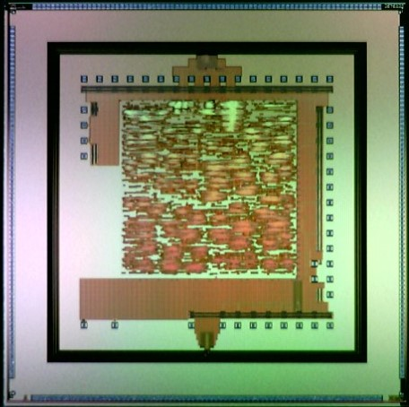
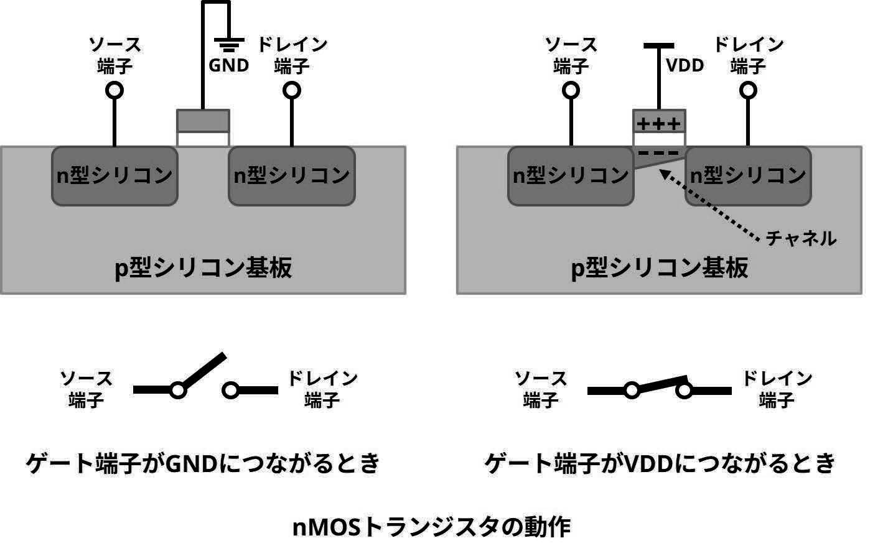
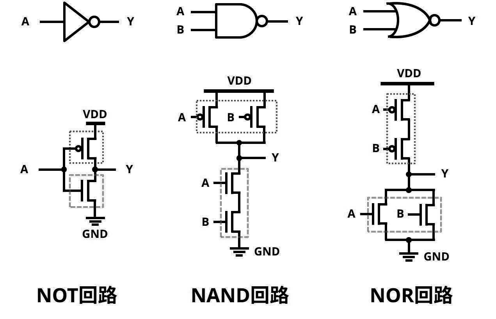
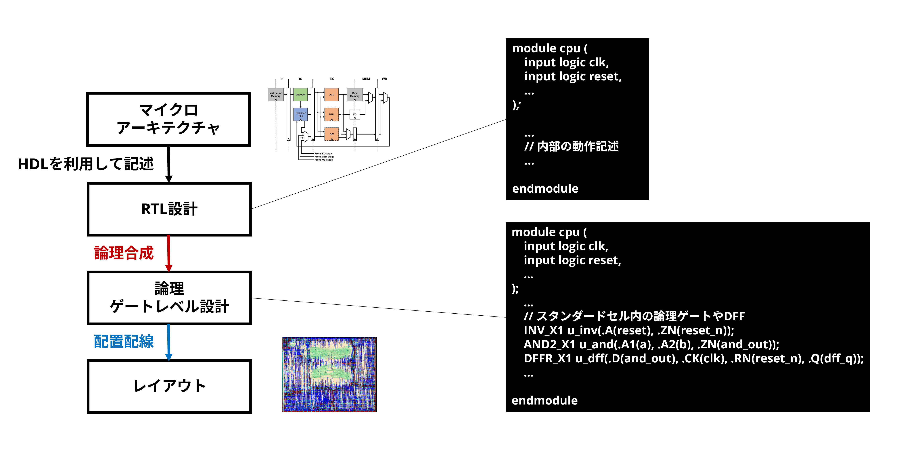
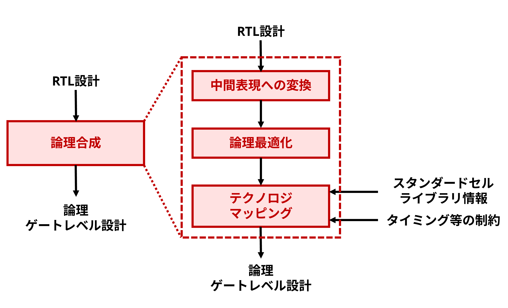
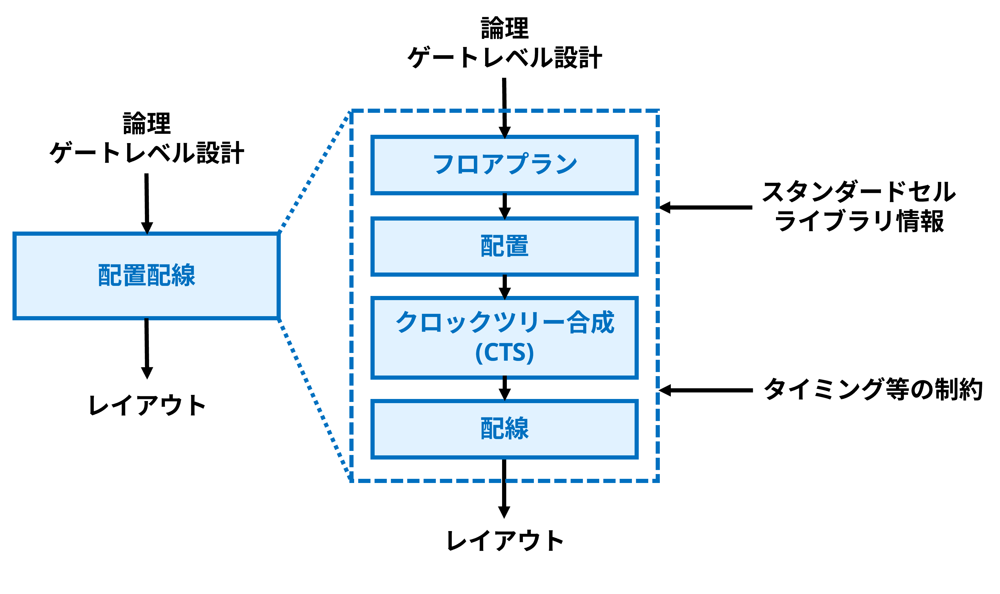
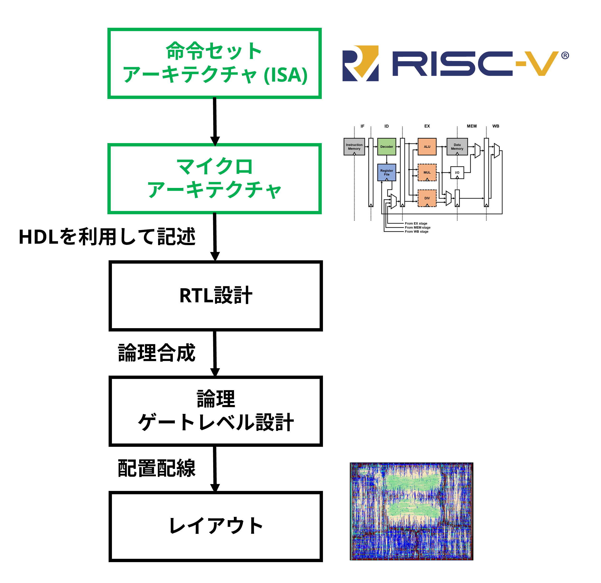

# 第1回 イントロダクション

!!! abstract "本日の講義内容"
    - VLSIの概要と成り立ち
    - 現代的なCMOS VLSI設計フロー
    - プロセッサアーキテクチャ

## VLSI

そもそもVLSIとは何でしょうか。初回の授業ではVLSIをその基本やあらましから見ていきましょう。皆さんの多くは論理回路や、ディジタルCMOS集積回路、MOSトランジスタの動作について学んできたと思います。そうした経験を通じて、VLSIが**Very Large Scale Integration**の略で、大規模にトランジスタが集積された回路だということはご存じのことと思います。さて、ところで、どのくらい大規模にトランジスタが集積されていると、**Very Large Scale**、な回路となるのでしょうか？

!!! question "Question: **Very Large Scale**とは、どのくらいでしょうか?"
    ??? Success "こたえ" 
        **普遍的な定義はありません**。たとえば、SSI (10論理ゲート程度まで), MSI (1000論理ゲート程度まで), LSI (1万論理ゲート程度まで), VLSI (10万論理ゲート程度まで), ULSI (それ以上)といった言葉や定義もありますが、
        実際のところ、ある程度大規模なディジタルCMOS集積回路であればまずVLSI、小規模でアナログ回路要素が多くてもまあVLSIと呼ぶ、くらいに使われている言葉のように思います。例として、アカデミックな世界には、[Symposium on VLSI Technology and Circuits](https://www.vlsisymposium.org/)といった名称の会議や、[IEEE Transactions on Very Large Scale Integration (VLSI) Systems](https://ieee-cas.org/publication/tvlsi)といった名称の論文誌が存在しますが、トランジスタの集積度が数万個に満たない回路がこれらのフォーカス外かというと、そんなことはありません。

たとえば、これはVLSIの例です。ちょうど10万論理ゲート程度を1チップ上に搭載したCMOS集積回路チップの写真になります。ここでは、0.18μm CMOS製造プロセスを利用しています。これは、1980年代初め頃の商用汎用プロセッサと同等のオーダの集積度になります。

<figure markdown="span">
  { width="400" }
  <figcaption>0.18μm CMOS製造プロセスで製造されたVLSI。10万論理ゲート程度の規模。汎用プロセッサと無線通信回路を搭載しています。</figcaption>
</figure>

!!! question "Open Question: このチップはVLSIとしては異常な見た目をしています。一体どこが普通ではないでしょうか?"

さて、VLSIは飛躍的な微細化・高集積化の道のりを辿ってきました。これについては有名な**ムーアの法則**や、**Dennardスケーリング**のことを学んできたことと思います。他の多くのデバイス、あるいは、他の多くの工学分野においては、微細化には何らかのドローバックが伴います。しかし、CMOS集積回路は、**微細化がむしろ性能向上とコスト低減の両立をもたらす**という、極めて特異な性質を示します。トランジスタのサイズを小さくすることで、スイッチング速度が向上し、同時に消費電力や製造コストが低下します。さらに、同一チップ面積内により多くのトランジスタを集積できるため、回路の高機能化が可能となります。

!!! question "Question: 現在最も集積度の高いVLSIには、どのくらいのトランジスタが集積されているでしょうか?"
    ??? Success "こたえ?" 
        **約4兆個 (Cerebras Wafer Scale Engine-3, 5nm FinFET製造プロセス) (たぶん)**。Wafer Scale Engineのような実装手法を1チップと見做すとすると、これが一番になると思います。ただし、こうした商用チップ内部のトランジスタ数を実際に数えることは困難なので詳細な数値には自信がありません。汎用アーキテクチャのプロセッサとしてはApple M3 Ultra、専用アーキテクチャのプロセッサ (GPU) としてはNvidia GB100がどちらも数千億個のトランジスタを集積しているようです。なお、1パッケージ内の集積度で考えると3次元積層されたV-NANDなどもトランジスタ数としては上位に入ってくる可能性があります。

このような性質により、CMOS技術は過去数十年にわたって驚異的な進化を遂げ、情報社会の中核を担う技術として発展してきました。しかし、極度の微細化が進む中で、こうした流れが徐々に限界を迎えつつあるのも事実です。トランジスタのサイズが原子スケールに近づくにつれ、リーク電流や熱の問題が顕著になり、単純なスケーリングによる性能向上は次第に困難になってきました。

こうした背景のもと、近年では**FinFET**や**GAAFET**、さらには**CFET**など、新しいトランジスタ構造のデバイスが登場しています。これらの技術はデバイスの研究だけでなく、集積回路の研究開発に携わる上でも理解しておくべき重要な知識です。本講義の後半では、**FinFETの活用を想定したVLSIの設計**を実施して貰うことになります。

<figure markdown="span">
  { width="400" }
  <figcaption>FinFETのイメージ図。今後の演習ではこうしたFinFET製造プロセスを想定した設計を実施していきます。</figcaption>
</figure>

本講義で学んでいく現在のVLSI設計技術は、階層化や抽象化の工夫により、こうした新たなデバイス技術に対しても柔軟に対応できる設計基盤を提供します。したがって、**将来的に未知のデバイスが登場したとしても、それらを活かした集積回路の設計において十分に役立つ知見となるはず**です。


### CMOS VLSI

現代におけるVLSIの多くは、CMOS集積回路として実現されています。ディジタルCMOS集積回路について思い出してみましょう。ここでは、たとえば以下のようなMOSトランジスタから成る回路のことをそう呼ぶのでした。ディジタルCMOS集積回路においては、各MOSトランジスタはスイッチのように働きます。

<figure markdown="span">
  { width="800" }
  <figcaption>MOSトランジスタの動作を単純化すると、ゲート電圧に応じてスイッチのように働くのでした。</figcaption>
</figure>

このように、スイッチとして振る舞う複数のMOSトランジスタが組み合わさって論理ゲートとしての動作を実現し、そうした論理ゲートがさらに組み合わさることで、より複雑な論理回路を実現することができるのでした。

<figure markdown="span">
  { width="800" }
  <figcaption>MOSトランジスタが相補的 (complementary) な構成をとることで、様々に利点のあるCMOS論理回路を実現可能なのでした。</figcaption>
</figure>

こうした論理ゲートを組み合わせることを**ボトムアップ**に続けていけば、先ほど見てきたようなVLSIを設計することができるでしょうか? もしかすると、1000ゲート程度までならできるかもしれません。しかし、1万ゲートとなるとどうでしょう? ましてや、1000億ゲートでは?

VLSIの設計は、このような**複雑性**との闘いです。高集積化にともなって複雑度を増していくVLSIの設計を進めていくために、設計者は様々な工夫を凝らしてきました。以降では、これまでに様々な人間の手で洗練されてきた現代的なCMOS VLSI設計フローについて概説します。

!!! question "Open Question: アナログCMOS集積回路の設計や、ディスクリートICを用いた回路の設計と比較してみるとどうでしょう?"

!!! Tip "Introduction to VLSI Systems"
    初期のVLSI設計に大きな影響を与えたものとして、[Introduction to VLSI Systems](https://books.google.co.jp/books/about/Introduction_to_VLSI_Systems.html?id=fQojAAAAMAAJ&source=kp_book_description&redir_esc=y)という書籍があります。また、当時のVLSI設計フローやその教育に関するものとして、[この記事](https://en.wikipedia.org/wiki/Mead%E2%80%93Conway_VLSI_chip_design_revolution)などは非常に面白いです。

!!! Tip "SoC/SiP/Chiplet"
    ここでお話した複雑性、は単一のチップ (ダイ、とも呼ばれます) の上の話です。近年のコンピュータシステムにおいては、複数のチップを用いてシステムを構築する例が増えてきています。様々な機能を単一のVLSIチップに集積し実装したものをSoC (System on Chip/System on a Chip) と呼びます。一方、複数のVLSIチップによってシステムを構築し、それを単一のパッケージ内に集積したものをSiP (System in Package/System in a Package) と呼びます。最近では、SiPのような実装手法や、それを構成する各チップを指して、**Chiplet**という言葉が使われることも多くなっています。またSoCがSiPやChipletの対義語として利用されることも多くなっています。本講義では、このような複数VLSIによる実装を想定したマイクロアーキテクチャやRTL設計、具体的な実装技術には立ち入りませんが、今後ますます重要になっていく領域に思われます。

## CMOS VLSI設計フロー

このような**複雑性を手なづける方法として、階層化・抽象化があります**。複雑なもの層別に分け、上位のレベルにおいては下位のレベルの詳細を隠すことによって、複雑なものを単純なモデルとして扱うことができます。CMOS VLSIの設計フローは、具体的には以下の図に示すような**トップダウン**なものになります。

<figure markdown="span">
  { width="800" }
  <figcaption>CMOS VLSIの設計フロー。今後の演習ではこれを実践していきます。</figcaption>
</figure>

ここでは汎用プロセッサの設計を題材に簡易的に示しています。**マイクロアーキテクチャ**とは、プロセッサの**命令セットアーキテクチャ (ISA)** をどのようにハードウェアとして実装するかを定めた設計のことです。ISAを実現する回路構造や処理の流れを各機能ブロックやパイプライン構成のような抽象度で表現したものです。**RTL設計**は、そうしたデータの流れや回路構成をより詳細に表現したもので、HDLを用いて記述されます。このRTL設計を**論理合成**によって論理ゲートレベルの回路へと変換します。これも現在のフローではHDLによって記述されますが、その内部は大量の論理ゲートが呼び出され、それらが直接接続されるかたちになっています。こうした論理ゲートレベル設計は**配置配線**によって**レイアウト**へと変換されます。ここでレイアウトとは、シリコン上にトランジスタや配線を物理的にどう配置・接続するかを2次元平面上の図として定めたデータです。

こうした階層化・抽象化には少々異なった他のパターンもあり得ます。たとえば、上の例で想定しているように、汎用プロセッサのマイクロアーキテクチャのような抽象機械を元にしてHDLを使ってRTL設計をする場合もあれば、ほかに、もっとシンプルな有限オートマトンを元にHDLを使ってRTL設計をする、あるいは、特定のアルゴリズムを疑似コードや高級言語などで表現し、それを元にHDLを使ってRTL設計をする場合もあるでしょう。専用アーキテクチャの講義では、特に後者について扱っていくものと思います。

しかし**いずれの場合についても、RTL設計や、論理合成・配置配線といったフローの理解が重要になります。この講義は、まさにそうしたフローに習熟して貰うことを目的としています。**

### RTL設計

RTLとは、**Register Transfer Level**のことで、データをいつ、どこからどこへ転送するか、という処理を、クロックを基準とした動作で記述する抽象表現です。人間が理解・設計しやすく、シミュレーションも容易です。このような表現を、ハードウェア記述言語を用いて記述します。

本講義では特に、Verilog HDLの拡張版である**SystemVerilog**を採用して設計を進めていきます。設計向けの気の利いた機能の追加や、検証のための多様な機能が追加されています。次回以降、詳細に解説していきますが、今回はVerilog HDLの構文を思い出して貰うため、また、ちょっと気の利いたVerilog HDLとしてSystemVerilogを使っていくために、Verilog HDLとの分かりやすい違い数点を以下のコードを見ながら説明します。

``` systemverilog linenums="1" title="SystemVerilogを使ったシンプルな順序回路の例"
module led_controller (
    // SystemVerilogでは、logicという便利な型があります
    input logic clk,  // クロック信号
    input logic rst_n,  // 非同期リセット（負論理）
    output logic led_out  // LED出力（1で点灯）
);

    // 以下はMoore型ステートマシンです

    // typedefで型にstate_tと命名 (SystemVerilog特有です)
    // 状態を列挙型 (enum) で定義（SystemVerilog特有です）
    typedef enum logic [1:0] {
        IDLE,  // 初期状態
        ON,  // LED点灯
        OFF  // LED消灯
    } state_t;

    // 現在の状態と次の状態を保持する変数
    state_t current_state, next_state;

    // SystemVerilogでは、組み合わせ回路用のalways文、always_combがあります

    // 出力制御 (状態に応じてLED出力を決定)
    always_comb begin
        // SystemVerilogでは、複数ケースが同時に真にならないことを保証するための
        // キーワード unique があります
        unique case (current_state)  
            IDLE:    led_out = 1'b0;  // 初期状態では消灯
            ON:      led_out = 1'b1;  // ON状態では点灯
            OFF:     led_out = 1'b0;  // OFF状態では消灯
            default: led_out = 1'b0;  // 一応デフォルト
        endcase
    end

    // 状態遷移条件 (次状態の決定)
    always_comb begin
        unique case (current_state)
            IDLE:    next_state = ON;  // 起動後はONへ
            ON:      next_state = OFF;  // 点灯後は消灯
            OFF:     next_state = ON;  // 消灯後は再び点灯
            default: next_state = IDLE;  // デフォルトで初期化
        endcase
    end

    // SystemVerilogでは、順序回路用のalways文、always_ffもあります

    // 状態の更新
    always_ff @(posedge clk) begin
        if (!rst_n)
            current_state <= IDLE;  // リセット時は初期状態へ
        else
            current_state <= next_state;  // 次状態に遷移
    end

endmodule
```

### 論理合成

論理合成 (Logic synthesis, synthesis) は、ハードウェア記述言語で記述されたRTL設計を、**スタンダードセル**ライブラリ内のセルの組み合わせへと変換する工程です。ここでスタンダードセルライブラリとは、規格化された物理的サイズの各種論理ゲートセルのデータを集めたもので、物理的なレイアウトの他、HDLの形式で整備されたRTL設計や、ディジタル回路としての遅延や立上り・立下りなどのタイミング情報のまとまったライブラリなども含まれます。

<figure markdown="span">
  { width="800" }
  <figcaption>簡易的に表現した論理合成フロー。</figcaption>
</figure>

論理合成においては、まず、RTL設計をテクノロジ非依存な中間表現へと変換、最適化し、その後、特定の製造プロセスのスタンダードセルの組み合わせとなるようマッピングしていきます。このとき、回路として所望の動作を実現するために満たすべき制約も一緒に与えられます。FPGAでの設計を既に経験している方は、制約ファイルと聞くと具体的にイメージが湧くのではないかと思います。

論理合成の一連のフローは、ソフトウェアによって実現されます。代表的なツールとして、Synopsys Design Compiler (Fusion Compiler)、Cadence Genusなどが存在します。

### 配置配線

配置配線 (Place and route, P&R, PnR) は論理ゲートレベルの回路を物理的なレイアウトへと変換していく工程です。スタンダードセルを物理的にどのように配置し、配線するかを決定します。

<figure markdown="span">
  { width="800" }
  <figcaption>簡易的に表現した配置配線フロー。</figcaption>
</figure>

**フロアプラン**では、チップ全体のサイズや入出力パッドの位置、検証済の大きなマクロブロックの位置決め、スタンダードセルを自動配置していく領域の位置決め、などを実施します。その後**配置**ではスタンダードセルを具体的な場所に自動的に配置します。**クロックツリー合成 (CTS)** では、クロック信号をチップ全体に均等に分配するための回路を構成します。バッファの挿入やツリー状の配線によって、スキューや遅延を最小化します。最後に、セル間を**配線**し、レイアウトを得ます。スタンダードセルライブラリの情報や制約は、各工程で利用されます。

配置配線についても、一連のフローは、ソフトウェアによって実現されます。代表的なツールとして、Synopsys IC Compiler (Fusion Compiler)、Cadence Innovusなどが存在します。

!!! Tip "スタンダードセルの誕生"
    さて、このような設計フローを実現する上で重要なスタンダードセルや配置配線ツールは、いつ頃生まれたのでしょうか？初期の代表的な例として、[Intel i386](https://ja.wikipedia.org/wiki/Intel_80386)が知られています。i386は32-bitの汎用プロセッサで、x86アーキテクチャやその後のOSやPCの隆盛を語る上でも重要なVLSIですが、VLSI設計技術の観点でも重要な節目を成しています。i386の内部を見てみると、たしかに、一部のディジタル回路が規格化されたセルによって構成されており、現在の配置配線フローで設計したマクロと近い見た目になっていることがわかります。このような内部構造について調査した[ブログ記事](https://www.righto.com/2024/01/intel-386-standard-cells.html)が存在します。
    また、米国のベル研究所でも同様にPolycellという名前でスタンダードセルの研究がなされており
    ["An optimum channel-routing algorithm for polycell layouts of integrated circuits," DAC1988.](https://dl.acm.org/doi/10.1145/62882.62886)のような論文で当時の技術について知ることができます。

!!! Tip "AI時代のVLSI設計フロー"
    現在、あらゆるものの設計開発フローにAI/ML技術が導入されようとしています。あるいは、多くのものが既にAIによって設計されるようになっています。VLSIも例外ではありません。アカデミックな世界ではAI/MLや設計自動化 (EDA) 関連の会議でそうしたトピックが盛り上がりを見せるほか、[ACM/IEEE International Symposium on Machine Learning for CAD (MLCAD)](https://mlcad.org/symposium/2025/) のような専門の会議が立ち上がるなどしています。この先の世界では、**AIの利用を前提としたとき、VLSI設計における階層化・抽象化やそれらの間のインタフェースはどうあるべきなのか**、という問いが極めて重要なものになっていくと思います。そうしたことを考えていくに当たっての出発点としても、やはり、まず人間にとって非常に適していたこれまでの設計フローについて学んでいきましょう。

## プロセッサアーキテクチャ

さて、本講義では、汎用プロセッサをVLSIとして実現することを目指します。先に述べたVLSIの設計フローを振り返ってみると、まずマイクロアーキテクチャの策定が必要になるのでした。また、さらに抽象度の高い設計として、命令セットアーキテクチャが存在するのでした、こうした抽象度の設計を一般にプロセッサの**アーキテクチャ**と呼びます。コンピュータアーキテクチャについて学んだ経験のある方は、この辺りのことを思い出してみましょう。

<figure markdown="span">
  { width="600" }
  <figcaption>VLSI設計フローにおけるプロセッサアーキテクチャの位置付け。</figcaption>
</figure>

### 汎用アーキテクチャと専用アーキテクチャ

汎用アーキテクチャと専用アーキテクチャはその名の通り、汎用性が高く様々なアプリケーションを実行可能なプロセッサアーキテクチャと、特定のアルゴリズムやアプリケーション専用でそれに対して高い性能や電力効率を達成可能なプロセッサアーキテクチャを指しています。現代では多くのVLSIは汎用アーキテクチャと専用アーキテクチャのプロセッサを混載したヘテロジニアスな構成をとるようになっています。

これらに明確な線を引くことは難しいのですが、本講義では、汎用アーキテクチャとして、**汎用性の高いISAを持ち、多様なソフトウェアを実行可能な汎用プロセッサ**を扱います。一般に、**CPU**と呼ばれることが多いものです。

!!! question "Open Question: FPGAは汎用アーキテクチャでしょうか? それとも専用アーキテクチャでしょうか?" 

!!! question "Open Question: 量子コンピュータは汎用アーキテクチャでしょうか? それとも専用アーキテクチャでしょうか?" 

### RISCマイクロプロセッサ

命令セットアーキテクチャの分類として、CISCとRISCというものがあります。RISC ISAは、まさにVLSIが隆盛し、汎用プロセッサがVLSIとして、すなわち、**マイクロプロセッサ**として実現され始めた時代に誕生しました。

> ["RISC I: A Reduced Instruction Set VLSI Computer," ISCA1981.](https://dl.acm.org/doi/10.5555/800052.801895)

1サイクルで実行可能かつ固定長の命令、ロード命令・ストア命令のみによるメモリアクセスといったRISCの特徴は、設計の単純化をもたらし、VLSIとしての設計・最適化を容易なものにしました。

現代の汎用プロセッサの多くも、こうしたRISCの設計思想に基づくアーキテクチャを採用したマイクロプロセッサとして実現されています。特にこの講義では、シンプルかつ洗練されたRISC ISAである、**RISC-V ISA**を採用し、汎用プロセッサを設計していきます。

<figure markdown="span">
  { width="600" }
  <figcaption>RISC-Vのロゴ。</figcaption>
</figure>


!!! Tip "オープンなVLSI設計環境"
    ソフトウェアの世界でオープンソース化が様々な成功を生んだように、VLSI設計というハードウェアの世界でも設計資産や設計ツールのオープン化、その活用が試みられています。今回示したRISC-V ISAもその一例です。このようなオープンな設計環境については、後の講義で再訪することになるでしょう。

## :material-note-edit-outline: 宿題

今回はガイダンスなのでここまでです。宿題として以下をお願いします。次回以降に用いる設計環境の準備になります。

1. 講義で利用するPC上で公開鍵を作成し、Slackチャンネルへ共有してください **(週末までにお願いします)**。
2. 講義で利用するPCにVNC Viewer (たとえば[これ](https://uvnc.com/))をインストールしておいてください。

## :material-page-next: 次回予告

次回は、汎用アーキテクチャのプロセッサを実際に設計していきます。SystemVerilogやRISC-V ISA、RISC-Vに基づくプロセッサについて、興味のある方は予習してみてください。

