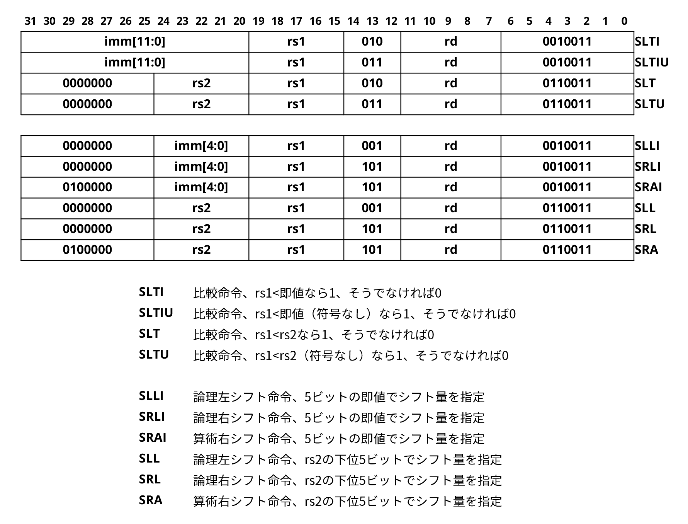

#  第2回 プロセッサの設計1

!!! abstract "本日の講義内容"
    - 設計環境
    - SystemVerilog入門
    - RISC-V ISA入門
    - 汎用プロセッサの設計 (1)


## 設計環境

SystemVerilogを用いて記述したRTL設計が正常に動作するか検証するために、本講義では、HDLシミュレータである、Cadence Xceliumを利用します。このツールや、これが導入された設計環境の詳細については、別途資料を用いて説明します。もし環境の不具合等で利用できない場合、他の導入しやすいHDLシミュレータとして

* [Verilator](https://www.veripool.org/verilator/)
    * [VerilatorのGitHubリポジトリ](https://github.com/verilator/verilator)
    * [Verilatorの関連資料](https://veripool.org/papers/)
* [Icarus Verilog](https://bleyer.org/icarus/)

などがあります。これらを利用すると良いでしょう。基本的にお好みの環境で問題ありません。ただし、次回以降におこなう**論理合成や配置配線については、こちらで準備した環境上で実行する必要があります**。アカウントにログインできることをぜひ確認しておいてください。なお、他のHDLシミュレータの例として、Siemens ModelSim/Questaといった商用ツールも同様の機能を持っています。これらは今後VLSI設計に携わる中で使う機会があるかもしれません。


## SystemVerilog 101

本講義では、SystemVerilogを用いて汎用プロセッサのRTL設計を記述していきます。SystemVerilogはVerilog HDLの後継、かつ上位互換にあたるもので、文法の多くはVerilog HDLと共通しています。しかし、**SystemVerilogでは型や制御構文が強化され、安全で読みやすいコードが書けるようになっています**。

SystemVerilogには、設計、検証においてそれぞれ利点があります。本講義で触れるのはその一部に留まり、また設計の方が中心になります。しかし、SystemVerilogは本来、設計と検証の統一言語を目指しており、検証用の高度な機能も多数加えられています。

大規模なVLSIを精緻に検証する必要がある場合、あるいは、そうしたVLSIを構成するために、複数のIPへと分割し、統一的な検証をおこなう必要がある場合などは、そのような検証機能が重要になります。SystemVerilogに基づいて**標準化された検証フレームワークであるUVM (Universal Verification Methodology)** の存在については、特に覚えておくと良いでしょう。

### SystemVerilog手習い

HDLは回路図をテキストで記述するための言語で、ソフトウェアのように手続きを書くのではなく、回路そのものを定義するのでした。Verilog/SystemVerilogにおける回路部品は`module`という箱のようなものとして定義され、入力信号`input`と出力信号`output`を持つのでした。

SystemVerilogには、`logic`という型が存在し、信号は基本的に`logic`として宣言すればよいです。

!!! exercise "演習: AND回路の設計"
    以下のコードに追記して、4-bitのAND回路を設計しましょう。
    ``` systemverilog linenums="1"
    module and (
        input logic [3:0] a,
        input logic [3:0] b,
        output logic [3:0] y
    );
    ```
    ??? Success "こたえ" 
        ``` systemverilog linenums="1"
        module and (
            input logic [3:0] a,
            input logic [3:0] b,
            output logic [3:0] y
        );
            assign y = a & b;
        endmodule
        ```

SystemVerilogでは、複雑な組み合わせ回路は、`always_comb`の中で`if`文や`case`文を利用することで記述できます。Verilogと異なり、組み合わせ回路専用の`always`があることで、より安全に回路を記述することができます。

!!! exercise "演習: 比較回路の設計"
    以下のコードに追記して、`a`と`b`を比較し、`a > b`のとき`1`を出力する比較回路を設計しましょう。
    ``` systemverilog linenums="1"
    module comp (
        input logic [2:0] a,
        input logic [2:0] b,
        output logic y
    );
    ```
    ??? Success "こたえ" 
        ``` systemverilog linenums="1"
        module comp (
            input logic [2:0] a,
            input logic [2:0] b,
            output logic y
        );
            always_comb begin
                if (a > b) begin
                    y = 1'b1;
                end else begin
                    y = 1'b0;
                end
        endmodule
        ```

また、`case`文については、`unique`キーワードを併せて利用することで、分岐条件が同時に2つ真になることが無いよう処理系で保証することができます。

!!! exercise "演習: セレクタ回路の設計"
    以下のコードに追記して、`sel`に応じて次のような`y`を出力するセレクタ回路を設計しましょう。
    
    * `sel`: 00 -> `y`: 0001
    * `sel`: 01 -> `y`: 0010
    * `sel`: 10 -> `y`: 0100
    * `sel`: 11 -> `y`: 1000
    
    ``` systemverilog linenums="1"
    module sel (
        input logic [1:0] sel,
        output logic y
    );
    ```
    ??? Success "こたえ" 
        ``` systemverilog linenums="1"
        module sel (
            input logic [1:0] sel,
            output logic y
        );
            always_comb begin
                unique case (sel)
                    2'b00: y = 4'b0001;
                    2'b01: y = 4'b0010;
                    2'b10: y = 4'b0100;
                    2'b11: y = 4'b1000;
                    // default: y = 4'b0001;  // 念のため
                endcase
            end
        endmodule
        ```

なお、簡単な条件の組み合わせ回路であれば、三項演算子`? :`を用いて`assign`で書くこともできます。

!!! exercise "演習: 最大値回路の設計"
    以下のコードに追記して、2つの4-bit信号`a`, `b`を比較し、大きい方の値を出力する回路を設計しましょう。三項演算子を使いましょう。
    ``` systemverilog linenums="1"
    module max (
        input logic [3:0] a,
        input logic [3:0] b,
        output logic [3:0] y
    );
    ```
    ??? Success "こたえ" 
        ``` systemverilog linenums="1"
        module max (
            input logic [3:0] a,
            input logic [3:0] b,
            output logic [3:0] y
        );
            assign y = (a > b) ? a : b;
        endmodule
        ```

順序回路は、`always_ff`の中で記述します。このとき、代入には通常**ノンブロッキング代入**`<=`を用います。`always_ff`の中に複数の代入文を記述するとしましょう。通常、依存関係を持たない複数の変数に対して、クロック遷移と同時に並列に値が代入されることを期待すると思います。こうした動作を実現するのがノンブロッキング代入です。複数のノンブロッキング代入文がある場合には同時に代入がおこなわれます。一方、**ブロッキング代入**`=`では、ある代入文の実行が終了するまで、後続の代入文は実行されません。つまり、**ブロック**します。そのため、代入に順序関係が生じ、順序回路に対して適用すると意図しない動作となることがあります。

!!! exercise "演習: DFF回路の設計"
    以下のコードに追記して、同期リセット機能付きのDFF回路を設計しましょう。
    ``` systemverilog linenums="1"
    module dff (
        input logic clk,
        input logic rst_n,
        input logic d,
        output logic q
    );
    ```
    ??? Success "こたえ" 
        ``` systemverilog linenums="1"
        module dff (
            input logic clk,
            input logic rst_n,
            input logic d,
            output logic q
        );
            always_ff @(posedge clk) begin
                if (!rst_n) begin
                    q <= 1'b0;
                end else begin
                    q <= d;
                end
            end
        endmodule
        ```

また、SystemVerilogでは、定数として`parameter`や`locaoparam`を使うことができます。前者は`module`の外部から指定可能なものであり、後者は`module`の内部だけで使う定数です。

``` systemverilog linenums="1"
// bit幅変更可能な加算器の例
module adder_param #(  
  parameter int WIDTH = 8  // 外部から変更可能なビット幅
) (
  input logic [WIDTH-1:0] a,
  input logic [WIDTH-1:0] b,
  output logic [WIDTH-1:0] y,
  output logic overflow
);

  // 加算結果の内部ビット幅を拡張 (1ビット余裕を持たせる)
  localparam int SUM_WIDTH = WIDTH + 1;

  // 加算結果を一時変数に保持
  logic [SUM_WIDTH-1:0] sum;

  assign sum = a + b;
  assign y = sum[WIDTH-1:0];  // 下位ビットのみ取り出す
  assign overflow = sum[WIDTH];  // 上位ビットが1ならオーバーフロー

endmodule
```


最後に簡単なステートマシンを作ってみましょう。

!!! exercise "演習: ステートマシンの設計"
    以下のコードに追記して、次のような仕様を持つステートマシンを設計しましょう。

    * 状態は、OFF->ON->OFF->ON->OFF->......と変わる
    * 入力: toggle (1のとき状態がトグルする)
    * 出力: toggle_out (現在 ON 状態なら 1)
    
    ``` systemverilog linenums="1"
    module toggle_fsm (
        input logic clk,
        input logic rst_n,
        input logic toggle,
        output logic toggle_out
    );

        // typedefとenumを使ってここで状態の定義をする
        
        // 定義した状態
        state_t state, next_state;

        // 次状態の計算
        always_comb begin
            unique case (state)
                OFF: next_state = ;
                ON: next_state = ;
                default: next_state = ;
            endcase
        end

        // 状態更新
        always_ff @(posedge clk) begin
            if (!rst_n) begin
                state <= ;
            end else begin
                state <= ;
            end
        end

        // 出力
        assign toggle_out = (state == );

    endmodule
    ```
    ??? Success "こたえ" 
        ``` systemverilog linenums="1"
        module toggle_fsm (
            input logic clk,
            input logic rst_n,
            input logic toggle,
            output logic toggle_out
        );

            typedef enum logic [0:0] {  // 明示的に幅を指定
                OFF = 1'b0,
                ON  = 1'b1
            } state_t;    

            state_t state, next_state;

            // 次状態の計算
            always_comb begin
                unique case (state)
                    OFF: next_state = toggle ? ON : OFF;
                    ON: next_state = toggle ? OFF : ON;
                    default: next_state = OFF;
                endcase
            end

            // 状態更新
            always_ff @(posedge clk) begin
                if (!rst_n) begin
                    state <= OFF;
                end else begin
                    state <= next_state;
                end
            end

            // 出力
            assign toggle_out = (state == ON);

        endmodule
        ```

このステートマシンを検証するためのテストベンチの記述を示します。テストベンチには検証用特有の記述がいくつか存在するのでした。

特に、`assert`は動作中に条件が満たされていることをチェックするために有用で、以下の例でも使用しています。

``` systemverilog linenums="1"
module tb_toggle_fsm;
    
    // クロック、リセット、入出力信号をテストベンチ側に用意し、
    // 内部で呼び出したテスト対象モジュールに接続する
    logic clk = 0;
    logic rst_n = 0;
    logic toggle;
    logic toggle_out;

    // テスト対象モジュールの呼び出しはこのようにおこなう
    // モジュールの各入出力信号は 
    // .モジュールの各入出力信号名(接続する外部信号名) 
    // として外部の信号と接続する
    toggle_fsm dut (
        .clk(clk),
        .rst_n(rst_n),
        .toggle(toggle),
        .toggle_out(toggle_out)
    );

    // クロック生成
    // #5はディレイで、5単位時間毎にclkを反転させる
    always #5 clk = ~clk;

    // リセットとテスト操作
    // initialはシミュレーション開始直後から1回限りの実行
    initial begin
        // displayはシミュレーション出力用
        $display("Start test...");
        toggle = 0;
        #2 rst_n = 0;  #10;
        rst_n = 1;     #10;

        // 初期状態: OFF
        // assertは条件チェックで、失敗時に自動でシミュレーション停止可能
        // 条件を満たしていれば何も起こさない
        assert(toggle_out == 0) else $fatal("Expected OFF at reset");

        // トグルしてONへ
        toggle = 1;  #10;
        toggle = 0;  #10;
        assert(toggle_out == 1) else $fatal("Expected ON after toggle");

        // トグルしてOFFへ
        toggle = 1;  #10;
        toggle = 0;  #10;
        assert(toggle_out == 0) else $fatal("Expected OFF after toggle");

        $display("All assertions passed.");
        $finish;
    end

endmodule
```

!!! exercise "演習: テストベンチを使ったシミュレーション"
    上のtb_toggle_fsm.svを用いてシミュレーションしてみましょう。
    
    Xceliumを使用する場合は、`%xrun tb_toggle_fsm.sv toggle_fsm.sv`というコマンドになります。

### コーディング規約

SystemVerilogの記述スタイルとしては、たとえば、[lowRISC Verilog Coding Style Guide](https://github.com/lowRISC/style-guides/blob/master/VerilogCodingStyle.md)が参考になるでしょう。シンプルかつ可読性が高く、論理合成可能なRTL設計を記述しやすいと思います。[OpenTitan](https://github.com/lowRISC/opentitan)のような大規模プロジェクトで採用されています。

具体的には、

* 各ファイルには1つの`module`のみを定義し、ファイル名は "`module`名.sv" とする
* 信号には`logic`を使う (`wire`や`reg`は使わない)
* クロック駆動の記述は`always_ff`、組み合わせ回路には`always_comb`を使う
    * 簡単な組み合わせ回路は`assign`を使って記述してもok
* `case`文では`unique`を使用
* 定数には`parameter`や`localparam`を使う (`define`は使わない)

あたりをまずは守ってみると良いでしょう。

!!! Tip "SystemVerilogの簡単な歴史"
    Verilog HDLは、 Automated Integrated Design Systems (後のGateway Design Automation) が開発したVerilogやVerilog-XLというシミュレータ用の記述言語として誕生しています。その後、Verilog-XLはCadenceの物となりました。本講義の設計環境で用いているCadence XceliumはVerilog-XLに様々な機能を統合し、進化させたものです。一方、SystemVerilogはCo-Design Automationが1999年に発表したSuperlogが原型となっています。Verilog HDLが設計・検証それぞれにおいて抱えていた弱点の克服を見据え、Verilog HDLとC言語それぞれの利点を取り入れるという方針で開発が進められたようです。SystemVerilogは2005年にIEEEによって標準化され、現在にいたっています。なお、規格としてのVerilog HDLはSystemVerilogへと統合されており、SystemVerilog (IEEE 1800) が唯一の後継というかたちになっています。


## RISC-V ISA

RISC-V (リスク・ファイブ) 命令セットアーキテクチャ (ISA) は、2010年ごろ、UC Berkeleyで開発が開始されたオープンなISAです。当時、多くのISAは商用ライセンスが必要で、アカデミックな研究や教育に使いづらかったため、オープンで自由に使えるISAとして設計されました。

RISCの原則に基づいて、シンプルかつ洗練された設計となっているほか、モジュラ形式という特徴もあります。これは、命令セットが、

* RV32I (基本整数命令)
* RV32M (乗除算命令)
* RV32A (アトミック命令)
* RV32F (単精度浮動小数点命令)
* RV32D (倍精度浮動小数点命令)
* RV32C (圧縮命令) 

といったように基本命令セットの他に様々な拡張命令モジュールへと分割されており、必要に応じてこれらを組み合わせることができるというものです。なお、RV32I or RV64Iに対して、MAFD, Zicsr, Zifenceiといった拡張を施したものを**RV32G** or **RV64G**と呼び、よく用いられる汎用的な命令セットになっています。

現在は、RISC-V Internationalという非営利団体がこうした仕様を管理しており、公式な各種仕様や周辺ツールについては

* [公式サイト](https://riscv.org/specifications/ratified/)
* [GitHub organization](https://github.com/riscv)

に情報がまとまっています。

以降では、最もシンプルな32-bit ISA、**RV32I**について見ていきましょう。本講義ではこの**RV32I**を用いてプロセッサを設計していきます。非常にシンプルですが、この命令セットだけの実装でもCやRustといった高級言語で記述したソフトウェアをきちんとプロセッサ上で動作させることができます。

### RISC-V RV32I

RISC-V RV32Iの中で今回実装していく命令をある程度の大きさで分類すると、

* 算術演算命令
* 論理演算命令
* 比較命令
* シフト命令
* LUI命令/AUIPC命令
* ロード命令
* ストア命令
* 条件分岐命令
* ジャンプ命令

といったものがあり、**合計37種類**の命令になります。これらについて、順に説明していきます。

<figure markdown="span">
  { width="800" }
  <figcaption>算術演算命令と論理演算命令。</figcaption>
</figure>

まず、算術演算命令と論理演算命令です。各命令は32bitから成っており、下位7bitで命令種別を表し、その他のフィールドで、

* `rs1`: ソースレジスタ番号1 (5bit)
* `rs2`: ソースレジスタ番号2 (5bit)
* `rd`: デスティネーションレジスタ番号 (5bit)
* `imm`: 即値

といったものが記述されています。ここで、レジスタ番号は32個存在するレジスタのうちどこに格納された値を演算に用いるか、あるいはどこに演算結果を書き込むかを表しています。5bitで32種類のレジスタいずれかをを指定します。即値は、命令に直接埋め込まれている定数で、この値も演算に用いられます。

それぞれの命令の内容に沿った演算がこうしたソースレジスタの値や即値を用いて実行され、デスティネーションレジスタへと書き込まれます。RISC-V ISAでは、基本的に即値は、32-bitの値へと符号拡張されてから演算に用いられます。ここで符号拡張とは、符号ビットを保ったまま拡張する方法で、たとえば最上位ビットが0なら左側に0を埋めていき、1なら1を埋めていくのでした。また、論理演算命令では、ビット毎に演算がおこなわれます。

<figure markdown="span">
  { width="800" }
  <figcaption>比較命令とシフト命令。</figcaption>
</figure>

比較命令は、各種比較の結果としてデスティネーションレジスタに0か1の値を書き込みます。

シフト命令では、シフトの量として**即値やrs2の下位5bitのみが利用されることに注意が必要です**。右シフト命令にはシフトの結果として空いた左側のビットに0を埋める論理右シフト命令と、空いた左側のビットに符号ビット (最上位ビット) を埋める算術右シフト命令があります。

<figure markdown="span">
  { width="800" }
  <figcaption>LUI命令とAUIPC命令。</figcaption>
</figure>

LUIとAUIPCは少し特殊な命令です。LUIは20bitの即値を上位20bitとして下位12bitはゼロで埋め、レジスタに書き込む命令です。これに続いてADDIなどで下位bitを加えることで、32bitの大きな定数を作ることができます。AUIPCは20bitの即値を上位20bitとしてPC (プログラムカウンタ) の値に足し、デスティネーションレジスタに書き込みます。後述するJALRと組み合わせることで、任意の32bit相対アドレスへのジャンプを可能にします。

<figure markdown="span">
  { width="800" }
  <figcaption>ロード命令とストア命令。</figcaption>
</figure>

ロード命令とストア命令は、メモリの`rs1+imm`で指定されたアドレスに対してロードやストアを実行します。それぞれ、1バイトや2バイト、4バイトと取り扱うデータの単位が異なる複数の命令が存在します。また、ロード命令についてはロードしてきたデータの取り扱いとして、符号拡張とゼロ拡張 (左側を0で埋める) の2種類が存在します。

<figure markdown="span">
  { width="800" }
  <figcaption>条件分岐命令とジャンプ命令。</figcaption>
</figure>

条件分岐命令は、値の比較の結果を元に分岐をおこなう命令です。分岐する場合の分岐先アドレスは`pc+imm`になります。ジャンプ命令では、JALの場合`pc+imm`、JALRの場合`pc+rs1`というアドレスに、それぞれジャンプします。ここでデスティネーションアドレスには、`pc+4`という値を書き込みます。


!!! question "Open Question: RISC-V ISAにおける即値の順番はどうしてこんなにバラバラになっているのでしょうか?"

なお、RV32Iには他に下記のような命令が存在します。

* FENCE
    * マルチスレッド、マルチコア環境、あるいは外部デバイスなどが存在する場合にメモリアクセス順序を制御するための命令
* ECALL/EBREAK
    * 例外を発生させOSやデバッガへ制御を引き渡すための命令

これらはプロセッサ単体をベアメタル環境 (OSなどが無い環境) で動作させる際には考慮の必要が無いため今回は触れませんが、**ISAの、システムソフトウェアとハードウェアとの界面という役割を考える上では非常に重要な命令**です。システムソフトウェアに興味のある方は、これらや**Zicsr**拡張命令についてその詳細を知っておくとよいでしょう。

また、RISV-Vのレジスタファイルは1個のゼロレジスタ (常に0の値をとるレジスタ) と31個の汎用レジスタにより構成されます。**この各レジスタの役割はRISC-Vのアプリケーションバイナリインタフェース (ABI) 規約の中で定められています**。

<figure markdown="span">
  { width="600" }
  <figcaption>各レジスタの役割。</figcaption>
</figure>

規約の詳細については前述した[公式サイト](https://riscv.org/specifications/ratified/)で知ることができます。こちらについても**ソフトウェア以上のレイヤとの関係が知りたい方はぜひ確認しておくと良い**と思います。

!!! Tip "DEC Alpha"
    DEC Alpha ISAは1990年代にDigital Equipment Corporation（DEC） が開発したRISC ISAです。先行する命令セットであるVAXと比較してRISCの特徴を数多く導入し、高性能化を追及しました。シンプルな固定長命令、豊富なレジスタ、ロードストア型アーキテクチャといった設計思想は、近年のRISC-Vにも通じるものであり、ISAの簡素さが高効率な実装につながるという理念は、当時すでに明確に現れていました。Alpha ISAに基づく汎用プロセッサである21164や21264は、**洗練されたマイクロアーキテクチャに基づいて、非常なエンジニアリングコストをつぎ込んで回路やレイアウトを最適化**しています。その一端は、たとえば、["High-Performance Microprocessor Design," JSSC1998.](https://ieeexplore.ieee.org/document/668981)で説明されるタイミングクリティカルなパスの手作業による回路・配線調整や、電源のカスタム設計に見ることができます。こうしたカスタム設計による恩恵は、**0.35μm CMOSプロセスにおいて、最大動作周波数が600MHz**という値から定量的に窺い知ることもできます。今後、ある程度の規模のディジタル回路を論理合成で設計する際、この値を思い出してみると良いでしょう。現状の先端汎用プロセッサの大部分は、スタンダードセルの論理合成や配置配線によって設計されています。フロアプランや電源設計について、あるいは、ボトルネックとなるような特定の個別回路について、局所的には手のかかった最適化がおこなわれていることでしょう。しかし、回路設計とプロセス設計との分業が進んだこと、また、設計における主要な目標が消費エネルギーや熱密度の低減へと移ってきたこともあり、Alphaのプロセッサ群を思わせる種類の最適化は実施されていないのではないかと想像します。

## 汎用プロセッサの設計 (1)

### 汎用プロセッサの全体構成

本講義ではまず、シングルサイクルで動作するプロセッサを想定して各種機能ブロックの設計を進め、やがて全体のパイプライン化やマイクロアーキテクチャ最適化に取り組んでいきます。

<figure markdown="span">
  { width="800" }
  <figcaption>プロセッサの全体図。</figcaption>
</figure>

具体的には、上図に示すような構成のプロセッサを設計していきます。全体を眺めると配線が複雑に見えますが、個別に動作を見ていくと非常にシンプルです。最初は、詳細なクロック駆動のタイミングなどを考慮せず、プロセッサ全体の動作の流れや各機能ブロックの働きについて見ていきましょう。

<figure markdown="span">
  { width="800" }
  <figcaption>プログラムカウンタによるアドレス指定。</figcaption>
</figure>

まず、**プログラムカウンタ (PC)** によるフェッチアドレスの指定です。PCは次に実行する命令のアドレスを出力します。クロック毎に次に実行するアドレスへと出力を更新していきます。条件分岐命令やジャンプ命令の無い場合には、分岐フラグ (`br_taken`) が立たず、`pc`に4を足したものが次のアドレスになります。分岐が実行される際には、`br_taken`が立ち、分岐先アドレス`br_addr`の値が次のアドレスとなります。この`br_addr`については後のステージで計算されたものが入力されています。

<figure markdown="span">
  { width="800" }
  <figcaption>命令メモリからのフェッチ。</figcaption>
</figure>

次に、**命令メモリ**からのフェッチです。PCの指すアドレス`pc`に格納された32bitの命令列`insn`が読み出され、後段のレジスタファイルや命令デコーダへと入力されます。

<figure markdown="span">
  { width="800" }
  <figcaption>命令のデコード。</figcaption>
</figure>

その後、命令列`insn`は**レジスタファイル**と**命令デコーダ**へと入力されます。レジスタファイルには命令列の指定するデスティネーションレジスタ番号`rd`やソースレジスタ番号`rs1`、`rs2`が入力されます。それぞれに対応するレジスタの値として、`rs1_val`や`rs2_val`を出力します。また、命令デコーダは、`insn`を入力として

* 符号拡張した即値: `imm[31:0]`
* ALUの演算内容選択信号: `alu_code`
* ALUへの入力選択信号: `alu_op1_sel`, `alu_op2_sel`

といったものを生成します。これによって**ALU**で所望の演算を実行できるようにします。

また、

* ストア命令フラグ: `is_store`
* ロード命令フラグ: `is_load`

によって、**データメモリ**への書き込みの有無やデータメモリからの読み出しの有無を判定します。

<figure markdown="span">
  { width="800" }
  <figcaption>ALUによる演算実行。</figcaption>
</figure>

これを受けて、**ALU**を用いて演算が実行されます。`rs1_val`や`rs2_val`、`imm`といった信号から、命令に応じて生成された`alu_op1_sel`や`alu_op2_sel`によって選択されたものがALUへと入力されます。演算の種別も`alu_code`で適切なものが選択されます。また、ALUは分岐の有無`br_taken`についても判定します。並行して、分岐先のアドレス`br_addr`も計算されます。

<figure markdown="span">
  { width="800" }
  <figcaption>データメモリへのアクセス。</figcaption>
</figure>

それから、**データメモリ**へのアクセスがおこなわれます。ここでは、ALUによって計算されたアドレスに応じて、ロードやストアがおこなわれます。ストア命令フラグ`is_store`が立っている場合、このアドレスにデータ`rs2_val`が書き込まれます。

<figure markdown="span">
  { width="800" }
  <figcaption>レジスタファイルへの書き戻し。</figcaption>
</figure>

最後に、**レジスタファイル**への書き戻しが実行されます。ロード命令フラグ`is_load`が立っている場合はデータメモリからロードしてきた値が、それ以外の場合はALUの計算結果`alu_result`が、書き込まれます。

このように、個別のステージ毎に見てみると、プロセッサはシンプルに動いています。また、今PC以降に見てきた処理のステージは、典型的な5ステージパイプライン構成におけるそれと概ね一致しています。

### ALUの設計

具体的にプロセッサの各機能ブロックの設計を進めていきましょう。最初は、ALUです。ALU (Arithmetic Logic Unit) では、RISC-V ISAにおける加減算、論理演算、比較、シフトといった演算が実行されます。デコーダによって生成された制御信号に応じた演算を、2つの入力信号に対して、実行します。

!!! exercise "演習: ALUの設計"
    以下のコードを追記修正して、ALUを設計しましょう。
    ``` systemverilog linenums="1"
    `include "cpu_pkg.sv"

    module alu (
        input logic [4:0] alu_code,
        input logic [31:0] op1,
        input logic [31:0] op2,
        output logic [31:0] alu_result,
        output logic br_taken
    );

        import cpu_pkg::*;

        // 符号付き演算用
        logic signed [31:0] signed_op1, signed_op2;

        assign signed_op1 = signed'(op1);
        assign signed_op2 = signed'(op2);

        // 演算
        always_comb begin
            unique case (alu_code)
                ALU_ADD: alu_result = ;
                ALU_SUB: alu_result = ;
                ALU_XOR: alu_result = ;
                ALU_OR: alu_result = ;
                ALU_AND: alu_result = ;
                ALU_SLT: alu_result = ;
                ALU_SLTU: alu_result = ;
                ALU_SLL: alu_result = ;
                ALU_SRL: alu_result = ;
                ALU_SRA: alu_result = ;
                ALU_LUI: alu_result = op2;
                ALU_JAL: alu_result = op2 + 32'd4;
                default: alu_result = 32'd0;
            endcase
        end

        // 分岐判定
        always_comb begin
            unique case (alu_code)
                ALU_BEQ: br_taken = ;
                ALU_BNE: br_taken = ;
                ALU_BLT: br_taken = ;
                ALU_BGE: br_taken = ;
                ALU_BLTU: br_taken = ;
                ALU_BGEU: br_taken = ;
                ALU_JAL: br_taken = ENABLE;
                default: br_taken = DISABLE;
            endcase
        end

    endmodule
    ```
    なお、以下のようなパッケージを併せて作成しておくとincludeできると思います。
    ``` systemverilog linenums="1" title="cpu_pkg.sv"
    `ifndef CPU_PKG_SV
    `define CPU_PKG_SV

    package cpu_pkg;

        // alu_code
        parameter logic [4:0] ALU_ADD  = 5'd0;
        parameter logic [4:0] ALU_SUB  = 5'd1;
        parameter logic [4:0] ALU_XOR  = 5'd2;
        parameter logic [4:0] ALU_OR   = 5'd3;
        parameter logic [4:0] ALU_AND  = 5'd4;
        parameter logic [4:0] ALU_SLT  = 5'd5;
        parameter logic [4:0] ALU_SLTU = 5'd6;
        parameter logic [4:0] ALU_SLL  = 5'd7;
        parameter logic [4:0] ALU_SRL  = 5'd8;
        parameter logic [4:0] ALU_SRA  = 5'd9;
        parameter logic [4:0] ALU_LUI  = 5'd10;
        parameter logic [4:0] ALU_BEQ  = 5'd11;
        parameter logic [4:0] ALU_BNE  = 5'd12;
        parameter logic [4:0] ALU_BLT  = 5'd13;
        parameter logic [4:0] ALU_BGE  = 5'd14;
        parameter logic [4:0] ALU_BLTU = 5'd15;
        parameter logic [4:0] ALU_BGEU = 5'd16;
        parameter logic [4:0] ALU_JAL  = 5'd17;

    endpackage

    `endif
    ```

また、設計したALUについて、シミュレーションで動作を検証してみましょう。

!!! exercise "演習: ALUの検証"
    テストベンチを作成して、ALUを検証しましょう。
    assertを使うと良いと思います。

!!! Tip "RISC-V ISAに基づくオープンソース汎用プロセッサ"
    RISC-V ISAはオープンに公開された仕様であり、ライセンスフリーで使用できるため、それに基づいて実装されたプロセッサは、自由に設計・公開することが可能です。例として、非営利団体である[OpenHW Group](https://github.com/openhwgroup)や、ETH ZürichやUniversity of Bolognaのチームが中心となった[PULP Platform](https://github.com/pulp-platform)などから多様なプロセッサのRTL設計が公開されています、[こちら](https://pulp-platform.org/implementation.html)では実際に製造されたプロセッサチップについての情報も公開されています。

## :material-page-next: 次回予告

本日はここまでです。次回は、汎用プロセッサの設計の続きをおこなっていきます。興味のある方は汎用プロセッサのマイクロアーキテクチャについて予習してみてください。
