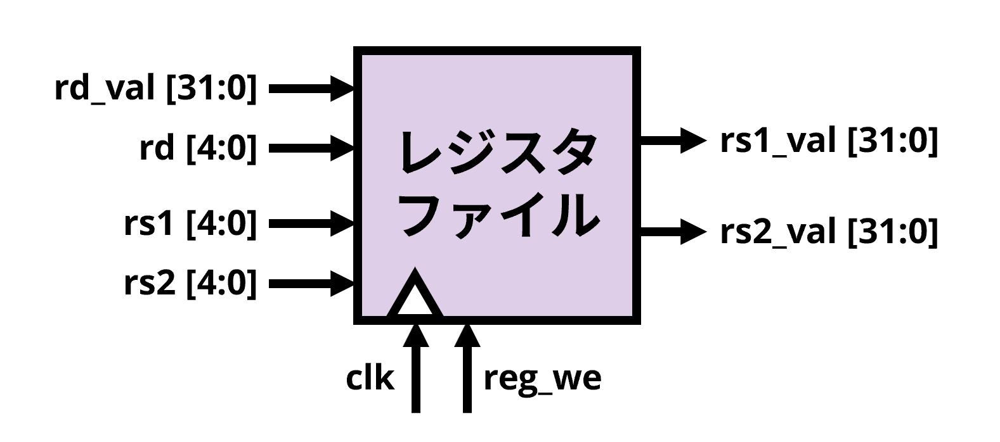
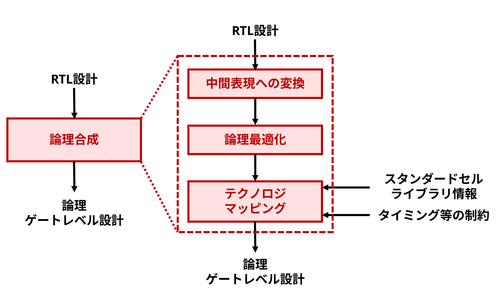

#  第3回 プロセッサの設計2

!!! abstract "本日の講義内容"
    - 汎用プロセッサの設計 (2)
    - Design Compilerを用いた論理合成


## 汎用プロセッサの設計 (2)

### ALUの設計の続き

<figure markdown="span">
  { width="800" }
  <figcaption>プロセッサの全体図。</figcaption>
</figure>

<figure markdown="span">
  { width="600" }
  <figcaption>ALU。</figcaption>
</figure>

ALUの設計を続けていきます。ALUでは、加減算、論理演算、比較、シフトその他の演算が実行されます。命令デコーダによって生成された制御信号`alu_code[4:0]`に応じた演算を、2つの入力信号`op1`、`op2`に対して実行するのでした。命令に応じた演算結果`alu_result[31:0]`を出力するとともに、分岐の有無についても判定し`br_taken`として出力します。[RV32I仕様](rv32i.md)を参考にして、各命令でどのような演算が実施されるか、各命令においてどのように分岐の有無が判定されるか、考えてみましょう。

!!! exercise "演習: ALUの設計"
    以下のコードを追記修正して、ALUを設計しましょう。
    ``` systemverilog linenums="1"
    module alu (
        input logic [4:0] alu_code,
        input logic [31:0] op1,
        input logic [31:0] op2,
        output logic [31:0] alu_result,
        output logic br_taken
    );

        import cpu_pkg::*;

        always_comb begin
            unique case (alu_code)
                ALU_ADD: alu_result = ;
                ALU_SUB: alu_result = ;
                ALU_XOR: alu_result = ;
                ALU_OR: alu_result = ;
                ALU_AND: alu_result = ;
                ALU_SLT: alu_result = ;
                ALU_SLTU: alu_result = ;
                ALU_SLL: alu_result = ;
                ALU_SRL: alu_result = ;
                ALU_SRA: alu_result = ;
                ALU_LUI: alu_result = op2;
                ALU_JAL, ALU_JALR: alu_result = op1 + 32'd4;
                default: alu_result = 32'd0;
            endcase
        end

        always_comb begin
            unique case (alu_code)
                ALU_BEQ: br_taken = ;
                ALU_BNE: br_taken = ;
                ALU_BLT: br_taken = ;
                ALU_BGE: br_taken = ;
                ALU_BLTU: br_taken = ;
                ALU_BGEU: br_taken = ;
                ALU_JAL, ALU_JALR: br_taken = ENABLE;
                default: br_taken = DISABLE;
            endcase
        end

    endmodule
    ```
    なお、以下のようなパッケージを別ファイルとして併せて作成しておきましょう。
    ``` systemverilog linenums="1" title="cpu_pkg.sv"
    package cpu_pkg;

        // control signals
        parameter logic ENABLE = 1'b1;
        parameter logic DISABLE = 1'b0;

        // alu_code
        typedef logic [4:0] alu_code_t;

        parameter alu_code_t ALU_ADD  = 5'd0;
        parameter alu_code_t ALU_SUB  = 5'd1;
        parameter alu_code_t ALU_XOR  = 5'd2;
        parameter alu_code_t ALU_OR   = 5'd3;
        parameter alu_code_t ALU_AND  = 5'd4;
        parameter alu_code_t ALU_SLT  = 5'd5;
        parameter alu_code_t ALU_SLTU = 5'd6;
        parameter alu_code_t ALU_SLL  = 5'd7;
        parameter alu_code_t ALU_SRL  = 5'd8;
        parameter alu_code_t ALU_SRA  = 5'd9;
        parameter alu_code_t ALU_LUI  = 5'd10;
        parameter alu_code_t ALU_BEQ  = 5'd11;
        parameter alu_code_t ALU_BNE  = 5'd12;
        parameter alu_code_t ALU_BLT  = 5'd13;
        parameter alu_code_t ALU_BGE  = 5'd14;
        parameter alu_code_t ALU_BLTU = 5'd15;
        parameter alu_code_t ALU_BGEU = 5'd16;
        parameter alu_code_t ALU_JAL  = 5'd17;
        parameter alu_code_t ALU_JALR = 5'd18;

    endpackage
    ```
    ??? Success "こたえ"
        ``` systemverilog linenums="1" title="alu.sv"
        module alu (
            input logic [4:0] alu_code,
            input logic [31:0] op1,
            input logic [31:0] op2,
            output logic [31:0] alu_result,
            output logic br_taken
        );

            import cpu_pkg::*;

            always_comb begin
                unique case (alu_code)
                    ALU_ADD: alu_result = op1 + op2;
                    ALU_SUB: alu_result = op1 - op2;
                    ALU_XOR: alu_result = op1 ^ op2;
                    ALU_OR: alu_result = op1 | op2;
                    ALU_AND: alu_result = op1 & op2;
                    ALU_SLT: alu_result = (signed'(op1) < signed'(op2)) ? 32'd1 : 32'd0;
                    ALU_SLTU: alu_result = (op1 < op2) ? 32'd1 : 32'd0;
                    ALU_SLL: alu_result = op1 << op2[4:0];
                    ALU_SRL: alu_result = op1 >> op2[4:0];
                    ALU_SRA: alu_result = signed'(op1) >>> op2[4:0];
                    ALU_LUI: alu_result = op2;
                    ALU_JAL, ALU_JALR: alu_result = op1 + 32'd4;
                    default: alu_result = 32'd0;
                endcase
            end

            always_comb begin
                unique case (alu_code)
                    ALU_BEQ: br_taken = (op1 == op2);
                    ALU_BNE: br_taken = (op1 != op2);
                    ALU_BLT: br_taken = (signed'(op1) < signed'(op2));
                    ALU_BGE: br_taken = (signed'(op1) >= signed'(op2));
                    ALU_BLTU: br_taken = (op1 < op2);
                    ALU_BGEU: br_taken = (op1 >= op2);
                    ALU_JAL, ALU_JALR: br_taken = ENABLE;
                    default: br_taken = DISABLE; 
                endcase
            end

        endmodule
        ```

!!! exercise "演習: ALUの検証"
    テストベンチを作成して、ALUを検証しましょう。
    assertを使うと良いと思います。
    ??? Success "こたえ"
        以下の`alu_tb.sv`のようなファイルを作成して、
        ```
        $ xrun alu_tb.sv alu.sv cpu_pkg.sv
        ```
        ``` systemverilog linenums="1" title="alu_tb.sv"
        `timescale 1ns/1ps

        module alu_tb;

            import cpu_pkg::*;
            
            logic [4:0] alu_code;
            logic [31:0] op1, op2;
            logic [31:0] alu_result;
            logic br_taken;

            alu dut (
                .alu_code(alu_code),
                .op1(op1),
                .op2(op2),
                .alu_result(alu_result),
                .br_taken(br_taken)
            );

            initial begin
                // ---- ALU_ADD ----
                alu_code = ALU_ADD; op1 = 10; op2 = 20;
                #1;
                assert (alu_result == 32'd30) else $fatal("ADD failed");

                // ---- ALU_SUB ----
                alu_code = ALU_SUB; op1 = 50; op2 = 20;
                #1;
                assert (alu_result == 32'd30) else $fatal("SUB failed");

                // ---- ALU_XOR ----
                alu_code = ALU_XOR; op1 = 32'hF0F0F0F0; op2 = 32'h0F0F0F0F;
                #1;
                assert (alu_result == 32'hFFFFFFFF) else $fatal("XOR failed");

                // ---- ALU_OR ----
                alu_code = ALU_OR; op1 = 32'hF0000000; op2 = 32'h0000F000;
                #1;
                assert (alu_result == 32'hF000F000) else $fatal("OR failed");

                // ---- ALU_AND ----
                alu_code = ALU_AND; op1 = 32'hFF00FF00; op2 = 32'h0F0F0F0F;
                #1;
                assert (alu_result == 32'h0F000F00) else $fatal("AND failed");

                // ---- ALU_SLT ---- (signed)
                alu_code = ALU_SLT; op1 = -5; op2 = 3;
                #1;
                assert (alu_result == 32'd1) else $fatal("SLT failed");

                // ---- ALU_SLTU ---- (unsigned)
                alu_code = ALU_SLTU; op1 = 32'hFFFFFFFF; op2 = 0;
                #1;
                assert (alu_result == 32'd0) else $fatal("SLTU failed");

                // ---- ALU_SLL ----
                alu_code = ALU_SLL; op1 = 1; op2 = 4;
                #1;
                assert (alu_result == 32'd16) else $fatal("SLL failed");

                // ---- ALU_SRL ----
                alu_code = ALU_SRL; op1 = 32'hF0000000; op2 = 4;
                #1;
                assert (alu_result == 32'h0F000000) else $fatal("SRL failed");

                // ---- ALU_SRA ----
                alu_code = ALU_SRA; op1 = 32'hFFFFFFF0; op2 = 4;
                #1;
                assert (alu_result == 32'hFFFFFFFF) else $fatal("SRA failed");

                // ---- ALU_LUI ----
                alu_code = ALU_LUI; op1 = 0; op2 = 32'h12345000;
                #1;
                assert (alu_result == 32'h12345000) else $fatal("LUI failed");

                // ---- ALU_BEQ ----
                alu_code = ALU_BEQ; op1 = 42; op2 = 42;
                #1;
                assert (br_taken == 1'b1) else $fatal("BEQ failed");

                // ---- ALU_BNE ----
                alu_code = ALU_BNE; op1 = 1; op2 = 2;
                #1;
                assert (br_taken == 1'b1) else $fatal("BNE failed");

                // ---- ALU_BLT ----
                alu_code = ALU_BLT; op1 = -10; op2 = 0;
                #1;
                assert (br_taken == 1'b1) else $fatal("BLT failed");

                // ---- ALU_BGE ----
                alu_code = ALU_BGE; op1 = 5; op2 = -5;
                #1;
                assert (br_taken == 1'b1) else $fatal("BGE failed");

                // ---- ALU_BLTU ----
                alu_code = ALU_BLTU; op1 = 1; op2 = 2;
                #1;
                assert (br_taken == 1'b1) else $fatal("BLTU failed");

                // ---- ALU_BGEU ----
                alu_code = ALU_BGEU; op1 = 5; op2 = 4;
                #1;
                assert (br_taken == 1'b1) else $fatal("BGEU failed");

                // ---- ALU_JAL ----
                alu_code = ALU_JAL; op1 = 100; op2 = 0;
                #1;
                assert (alu_result == 32'd104) else $fatal("JAL result failed");
                assert (br_taken == 1'b1) else $fatal("JAL branch failed");

                $display("✅ All ALU tests passed!");
                $finish;
            end

        endmodule
        ```


### 命令デコーダの設計

<figure markdown="span">
  { width="600" }
  <figcaption>命令デコーダ。</figcaption>
</figure>

続いて、命令デコーダの設計をおこないます。命令デコーダでは、32bitの機械語命令列`insn`を入力として

* 符号拡張した即値: `imm[31:0]`
* ALUの演算内容選択信号: `alu_code[4:0]`
* ALUへの入力選択信号: `alu_op1_sel`, `alu_op2_sel`
* ロード命令フラグ: `is_load[2:0]`
* ストア命令フラグ: `is_store[1:0]`

といったものを生成するのでした。

<figure markdown="span">
  { width="800" }
  <figcaption>RV32I命令フォーマット。</figcaption>
</figure>

まず、`imm[31:0]`について考えてみましょう。37命令のそれぞれについて見てみると、即値には次のようなパターンがあります。

* `insn[31:20]`を`imm[11:0]`として符号拡張:
    * ADDI, XORI, ORI, ANDI, SLTI, SLTIU, SLLI, SRLI, SRAI, LB, LH, LW, LBU, LHU, JALR
* `insn[31:12]`を`imm[31:12]`として下位を0で埋める:
    * LUI, AUIPC
* `{insn[31:25], insn[11:7]}`を`imm[11:0]`として符号拡張:
    * SB, SH, SW
* `{insn[31], insn[7], insn[30:25], insn[11:8]}`を`imm[12:1]`として符号拡張、下位1bitは0:
    * BEQ, BNE, BLT, BGE, BLTU, BGEU
* `{insn[31], insn[19:12], insn[20], insn[30:21]}`を`imm[20:1]`として符号拡張、下位1bitは0:
    * JAL

こうした分類をもとに考えて、まずは`imm[31:0]`を算出する組み合わせ回路を作ってみましょう。命令の下位7bitを`op_code[6:0]`として定義して、判別の手がかりにすると良いです。

!!! exercise "演習: 命令デコーダの即値算出部分の設計"
    以下のコードを追記修正して、命令デコーダの`imm[31:0]`算出部分を設計しましょう。
    ``` systemverilog linenums="1"
    module decoder (
        input logic [31:0] insn,
        output logic [31:0] imm,
        output logic [4:0] alu_code,
        output logic alu_op1_sel,
        output logic alu_op2_sel,
        output logic reg_we,
        output logic [2:0] is_load,
        output logic [1:0] is_store
    );

        logic [6:0] op_code;
        
        assign op_code = insn[6:0];
        
        always_comb begin
            unique case (op_code)
                OPIMM: imm = {{20{insn[31]}}, insn[31:20]};
            endcase
        end
    ```
    なお、以下のようなパラメータを利用すると良いです。
    ``` systemverilog linenums="1"
    // op_code
    typedef logic [6:0] op_code_t;

    parameter op_code_t OPIMM  = 7'b0010011;
    parameter op_code_t OPREG  = 7'b0110011;
    parameter op_code_t LUI    = 7'b0110111;
    parameter op_code_t AUIPC  = 7'b0010111;
    parameter op_code_t LOAD   = 7'b0000011;
    parameter op_code_t STORE  = 7'b0100011;
    parameter op_code_t BRANCH = 7'b1100011;
    parameter op_code_t JAL    = 7'b1101111;
    parameter op_code_t JALR   = 7'b1100111;
    ```
    ??? Success "こたえ"
        ``` systemverilog linenums="1"
        module decoder (
            input logic [31:0] insn,
            output logic [31:0] imm,
            output logic [4:0] alu_code,
            output logic alu_op1_sel,
            output logic alu_op2_sel,
            output logic reg_we,
            output logic [2:0] is_load,
            output logic [1:0] is_store
        );

            logic [6:0] op_code;

            assign op_code = insn[6:0];

            always_comb begin
                unique case (op_code)
                    OPIMM, LOAD, JALR: imm = {{20{insn[31]}}, insn[31:20]};
                    LUI, AUIPC: imm = {insn[31:12], 12'd0};
                    STORE: imm = {{20{insn[31]}}, insn[31:25], insn[11:7]};
                    BRANCH: imm = {{19{insn[31]}}, insn[31], insn[7], insn[30:25], insn[11:8], 1'd0};
                    JAL: imm = {{11{insn[31]}}, insn[31], insn[19:12], insn[20], insn[30:21], 1'd0};
                    default: imm = 32'd0;
                endcase
            end
        ```

次に、`alu_code[4:0]`について考えてみましょう。これは、それぞれの命令毎にALUにどのような演算を実行させるか、という制御信号でした。さきほどと同様に`op_code[6:0]`を手がかりにしつつ、それに加えて、`funct3[2:0]`といった信号を定義してこれを用いて分類すると見通しが良いです。[RV32I仕様](rv32i.md)を参考にしてみると良いでしょう。

!!! exercise "演習: 命令デコーダのALU制御信号算出部分の設計"
    以下のコードを追記修正して、命令デコーダの`alu_code[4:0]`算出部分を設計しましょう。
    ``` systemverilog linenums="1"
    logic [6:0] op_code;
    logic [2:0] funct3;

    assign op_code = insn[6:0];
    assign funct3 = insn[14:12];
    
    always_comb begin
        unique case (op_code)
            OPREG: begin
                unique case (funct3)
                    3'b000: alu_code = (insn[30] == 1'b1) ? ALU_SUB : ALU_ADD;
                endcase
            end
            OPIMM: begin
                unique case (funct3)
                    3'b000: alu_code = ALU_ADD;
                endcase
            end
            LUI: alu_code = ALU_LUI;
            AUIPC: alu_code = ALU_ADD;
            BRANCH: begin
                unique case (funct3)
                endcase
            end
            JAL: alu_code = ALU_JAL;
            JALR: alu_code = ALU_JALR;
            default: alu_code = ALU_ADD;
        endcase
    end
    ```
    なお、以下のようなパラメータを利用すると良いです。
    ``` systemverilog linenums="1"
    // op_code
    typedef logic [6:0] op_code_t;

    parameter op_code_t OPIMM  = 7'b0010011;
    parameter op_code_t OPREG  = 7'b0110011;
    parameter op_code_t LUI    = 7'b0110111;
    parameter op_code_t AUIPC  = 7'b0010111;
    parameter op_code_t LOAD   = 7'b0000011;
    parameter op_code_t STORE  = 7'b0100011;
    parameter op_code_t BRANCH = 7'b1100011;
    parameter op_code_t JAL    = 7'b1101111;
    parameter op_code_t JALR   = 7'b1100111;

    // alu_code
    typedef logic [4:0] alu_code_t;

    parameter alu_code_t ALU_ADD  = 5'd0;
    parameter alu_code_t ALU_SUB  = 5'd1;
    parameter alu_code_t ALU_XOR  = 5'd2;
    parameter alu_code_t ALU_OR   = 5'd3;
    parameter alu_code_t ALU_AND  = 5'd4;
    parameter alu_code_t ALU_SLT  = 5'd5;
    parameter alu_code_t ALU_SLTU = 5'd6;
    parameter alu_code_t ALU_SLL  = 5'd7;
    parameter alu_code_t ALU_SRL  = 5'd8;
    parameter alu_code_t ALU_SRA  = 5'd9;
    parameter alu_code_t ALU_LUI  = 5'd10;
    parameter alu_code_t ALU_BEQ  = 5'd11;
    parameter alu_code_t ALU_BNE  = 5'd12;
    parameter alu_code_t ALU_BLT  = 5'd13;
    parameter alu_code_t ALU_BGE  = 5'd14;
    parameter alu_code_t ALU_BLTU = 5'd15;
    parameter alu_code_t ALU_BGEU = 5'd16;
    parameter alu_code_t ALU_JAL  = 5'd17;
    parameter alu_code_t ALU_JALR = 5'd18;
    ```
    ??? Success "こたえ"
        ``` systemverilog linenums="1"
        logic [6:0] op_code;
        logic [2:0] funct3;

        assign op_code = insn[6:0];
        assign funct3 = insn[14:12];
        
        always_comb begin
            unique case (op_code)
                OPREG: begin
                    unique case (funct3)
                        3'b000: alu_code = (insn[30] == 1'b1) ? ALU_SUB : ALU_ADD;
                        3'b001: alu_code = ALU_SLL;
                        3'b010: alu_code = ALU_SLT;
                        3'b011: alu_code = ALU_SLTU;
                        3'b100: alu_code = ALU_XOR;
                        3'b101: alu_code = (insn[30] == 1'b1) ? ALU_SRA : ALU_SRL;
                        3'b110: alu_code = ALU_OR;
                        3'b111: alu_code = ALU_AND;
                        default: alu_code = ALU_ADD;
                    endcase
                end
                OPIMM: begin
                    unique case (funct3)
                        3'b000: alu_code = ALU_ADD;
                        3'b001: alu_code = ALU_SLL;
                        3'b010: alu_code = ALU_SLT;
                        3'b011: alu_code = ALU_SLTU;
                        3'b100: alu_code = ALU_XOR;
                        3'b101: alu_code = (insn[30] == 1'b1) ? ALU_SRA : ALU_SRL;
                        3'b110: alu_code = ALU_OR;
                        3'b111: alu_code = ALU_AND;
                        default: alu_code = ALU_ADD;
                    endcase
                end
                LUI: alu_code = ALU_LUI;
                AUIPC: alu_code = ALU_ADD;
                BRANCH: begin
                    unique case (funct3)
                        3'b000: alu_code = ALU_BEQ;
                        3'b001: alu_code = ALU_BNE;
                        3'b100: alu_code = ALU_BLT;
                        3'b101: alu_code = ALU_BGE;
                        3'b110: alu_code = ALU_BLTU;
                        3'b111: alu_code = ALU_BGEU;
                        default: alu_code = ALU_ADD;
                    endcase
                end
                JAL: alu_code = ALU_JAL;
                JALR: alu_code = ALU_JALR;
                default: alu_code = ALU_ADD;
            endcase
        end
        ```

<figure markdown="span">
  { width="600" }
  <figcaption>ALUへの入力信号選択部分。</figcaption>
</figure>

続いて、`alu_op1_sel`、`alu_op2_sel`の生成部についても記述していきましょう。これらはALUでの演算のために`rs1`、`rs2`、`imm`、`pc`といった値のどれを入力するのか決めるための信号でした。

ここでは、

* `alu_op1_sel == 1'b0` のとき: `rs1`
* `alu_op1_sel == 1'b1` のとき: `pc`
* `alu_op2_sel == 1'b0` のとき: `rs2`
* `alu_op2_sel == 1'b1` のとき: `imm`

としてみましょう。[RV32I仕様](rv32i.md)で各種命令での演算に用いられる値や、先ほどのALUの仕様を思い出しながら記述してみましょう。

!!! exercise "演習: 命令デコーダのALU入力選択信号算出部分の設計"
    以下のコードを追記修正して、命令デコーダの`alu_op1_sel`、`alu_op2_sel`算出部分を設計しましょう。
    ``` systemverilog linenums="1"
    logic [6:0] op_code;
    logic [2:0] funct3;

    assign op_code = insn[6:0];
    assign funct3 = insn[14:12];
    
    always_comb begin
        unique case (op_code)
            : begin
                alu_op1_sel = ;
                alu_op2_sel = ;
            end
            : begin
                alu_op1_sel = ALU_OP1_RS1;
                alu_op2_sel = ALU_OP2_RS2;
            end
            AUIPC, JAL, JALR: begin
                alu_op1_sel = ;
                alu_op2_sel = ;
            end
            default: begin
                alu_op1_sel = ALU_OP1_RS1;
                alu_op2_sel = ALU_OP2_RS2;
            end
        endcase
    end
    ```
    なお、以下のようなパラメータを利用すると良いです。
    ``` systemverilog linenums="1"
    // op_code
    typedef logic [6:0] op_code_t;
    parameter op_code_t OPIMM  = 7'b0010011;
    parameter op_code_t OPREG  = 7'b0110011;
    parameter op_code_t LUI    = 7'b0110111;
    parameter op_code_t AUIPC  = 7'b0010111;
    parameter op_code_t LOAD   = 7'b0000011;
    parameter op_code_t STORE  = 7'b0100011;
    parameter op_code_t BRANCH = 7'b1100011;
    parameter op_code_t JAL    = 7'b1101111;
    parameter op_code_t JALR   = 7'b1100111;

    // alu_code
    typedef logic [4:0] alu_code_t;
    parameter alu_code_t ALU_ADD  = 5'd0;
    parameter alu_code_t ALU_SUB  = 5'd1;
    parameter alu_code_t ALU_XOR  = 5'd2;
    parameter alu_code_t ALU_OR   = 5'd3;
    parameter alu_code_t ALU_AND  = 5'd4;
    parameter alu_code_t ALU_SLT  = 5'd5;
    parameter alu_code_t ALU_SLTU = 5'd6;
    parameter alu_code_t ALU_SLL  = 5'd7;
    parameter alu_code_t ALU_SRL  = 5'd8;
    parameter alu_code_t ALU_SRA  = 5'd9;
    parameter alu_code_t ALU_LUI  = 5'd10;
    parameter alu_code_t ALU_BEQ  = 5'd11;
    parameter alu_code_t ALU_BNE  = 5'd12;
    parameter alu_code_t ALU_BLT  = 5'd13;
    parameter alu_code_t ALU_BGE  = 5'd14;
    parameter alu_code_t ALU_BLTU = 5'd15;
    parameter alu_code_t ALU_BGEU = 5'd16;
    parameter alu_code_t ALU_JAL  = 5'd17;
    parameter alu_code_t ALU_JALR = 5'd18;

    // alu_op1
    typedef logic [0:0] alu_op1_t;
    parameter alu_op1_t ALU_OP1_RS1 = 1'b0;
    parameter alu_op1_t ALU_OP1_PC  = 1'b1;

    // alu_op2
    typedef logic [0:0] alu_op2_t;
    parameter alu_op1_t ALU_OP2_RS2 = 1'b0;
    parameter alu_op1_t ALU_OP2_IMM = 1'b1;
    ```
    ??? Success "こたえ"
        ``` systemverilog linenums="1"
        logic [6:0] op_code;
        logic [2:0] funct3;

        assign op_code = insn[6:0];
        assign funct3 = insn[14:12];
        
        always_comb begin
            unique case (op_code)
                OPIMM, LUI, LOAD, STORE, JALR: begin
                    alu_op1_sel = ALU_OP1_RS1;
                    alu_op2_sel = ALU_OP2_IMM;
                end
                OPREG, BRANCH: begin
                    alu_op1_sel = ALU_OP1_RS1;
                    alu_op2_sel = ALU_OP2_RS2;
                end
                AUIPC, JAL, JALR: begin
                    alu_op1_sel = ALU_OP1_PC;
                    alu_op2_sel = ALU_OP2_IMM;
                end
                default: begin
                    alu_op1_sel = ALU_OP1_RS1;
                    alu_op2_sel = ALU_OP2_RS2;
                end
            endcase
        end
        ```

残りの出力信号として、`reg_we`、`is_load`、`is_store`が存在します。こういった信号についても記述してみます。`reg_we`はデスティネーションレジスタに値を書き込むかどうか決定する信号です。デスティネーションレジスタの存在する命令についてはこれを用いて書き込むことを示したいです。`is_load`、`is_store`はそれぞれロード命令、ストア命令によるメモリ操作の有無や単位 (8bit、16bit、32bit) を示します。この信号に応じてデータメモリの読み書きが実施されます。

ここでは、

* `reg_we == 1'b0` のとき: デスティネーションレジスタへの書き込み無し
* `reg_we == 1'b1` のとき: デスティネーションレジスタへの書き込み有り

* `is_load == 3'b000` のとき: ロード無し
* `is_load == 3'b001` のとき: ロードバイト (8bit)、読み込んだデータは符号拡張
* `is_load == 3'b010` のとき: ロードハーフ (16bit)、読み込んだデータは符号拡張
* `is_load == 3'b011` のとき: ロードワード (32bit)、読み込んだデータは符号拡張
* `is_load == 3'b101` のとき: ロードバイト (8bit)、読み込んだデータはゼロ拡張
* `is_load == 3'b110` のとき: ロードハーフ (16bit)、読み込んだデータはゼロ拡張

* `is_store == 2'b00` のとき: ストア無し
* `is_store == 2'b01` のとき: ストアバイト (8bit)
* `is_store == 2'b10` のとき: ストアハーフ (16bit)
* `is_store == 2'b11` のとき: ストアワード (32bit)

となるように記述してみましょう。やはり、[RV32I仕様](rv32i.md)が参考になると思います。

!!! exercise "演習: 命令デコーダの各種フラグ信号算出部分の設計"
    以下のコードを追記修正して、命令デコーダの`reg_we`、`is_load`、`is_store`算出部分を設計しましょう。
    ``` systemverilog linenums="1"
    logic [6:0] op_code;
    logic [2:0] funct3;

    assign op_code = insn[6:0];
    assign funct3 = insn[14:12];
    
    // reg_we
    always_comb begin
        unique case (op_code)
            OPIMM, : reg_we = ENABLE;
            default: reg_we = DISABLE;
        endcase
    end

    // is_load
    always_comb begin
        unique case (op_code)
            LOAD: begin
                unique case (funct3)
                    default: is_load = LOAD_DISABLE;
                endcase
            end
            default: is_load = LOAD_DISABLE;
        endcase
    end

    // is_store
    always_comb begin
        unique case (op_code)
            STORE: begin
                unique case (funct3)
                    3'b000: is_store = ;
                    default: is_store = STORE_DISABLE;
                endcase
            end
            default: is_store = STORE_DISABLE;
        endcase
    end
    ```
    なお、以下のようなパラメータを利用すると良いです。
    ``` systemverilog linenums="1"
    // control signals
    parameter logic ENABLE = 1'b1;
    parameter logic DISABLE = 1'b0;

    // op_code
    typedef logic [6:0] op_code_t;
    parameter op_code_t OPIMM  = 7'b0010011;
    parameter op_code_t OPREG  = 7'b0110011;
    parameter op_code_t LUI    = 7'b0110111;
    parameter op_code_t AUIPC  = 7'b0010111;
    parameter op_code_t LOAD   = 7'b0000011;
    parameter op_code_t STORE  = 7'b0100011;
    parameter op_code_t BRANCH = 7'b1100011;
    parameter op_code_t JAL    = 7'b1101111;
    parameter op_code_t JALR   = 7'b1100111;

    // alu_code
    typedef logic [4:0] alu_code_t;
    parameter alu_code_t ALU_ADD  = 5'd0;
    parameter alu_code_t ALU_SUB  = 5'd1;
    parameter alu_code_t ALU_XOR  = 5'd2;
    parameter alu_code_t ALU_OR   = 5'd3;
    parameter alu_code_t ALU_AND  = 5'd4;
    parameter alu_code_t ALU_SLT  = 5'd5;
    parameter alu_code_t ALU_SLTU = 5'd6;
    parameter alu_code_t ALU_SLL  = 5'd7;
    parameter alu_code_t ALU_SRL  = 5'd8;
    parameter alu_code_t ALU_SRA  = 5'd9;
    parameter alu_code_t ALU_LUI  = 5'd10;
    parameter alu_code_t ALU_BEQ  = 5'd11;
    parameter alu_code_t ALU_BNE  = 5'd12;
    parameter alu_code_t ALU_BLT  = 5'd13;
    parameter alu_code_t ALU_BGE  = 5'd14;
    parameter alu_code_t ALU_BLTU = 5'd15;
    parameter alu_code_t ALU_BGEU = 5'd16;
    parameter alu_code_t ALU_JAL  = 5'd17;
    parameter alu_code_t ALU_JALR = 5'd18;

    // alu_op1
    typedef logic [0:0] alu_op1_t;
    parameter alu_op1_t ALU_OP1_RS1 = 1'b0;
    parameter alu_op1_t ALU_OP1_PC  = 1'b1;

    // alu_op2
    typedef logic [0:0] alu_op2_t;
    parameter alu_op1_t ALU_OP2_RS2 = 1'b0;
    parameter alu_op1_t ALU_OP2_IMM = 1'b1;

    // load
    typedef logic [2:0] load_type_t;
    parameter load_type_t LOAD_DISABLE = 3'b000;
    parameter load_type_t LOAD_LB      = 3'b001;
    parameter load_type_t LOAD_LH      = 3'b010;
    parameter load_type_t LOAD_LW      = 3'b011;
    parameter load_type_t LOAD_LBU     = 3'b101;
    parameter load_type_t LOAD_LHU     = 3'b110;

    // store
    typedef logic [1:0] store_type_t;
    parameter store_type_t STORE_DISABLE = 2'b00;
    parameter store_type_t STORE_SB      = 2'b01;
    parameter store_type_t STORE_SH      = 2'b10;
    parameter store_type_t STORE_SW      = 2'b11;
    ```
    ??? Success "こたえ"
        ``` systemverilog linenums="1"
        logic [6:0] op_code;
        logic [2:0] funct3;

        assign op_code = insn[6:0];
        assign funct3 = insn[14:12];
        
        // reg_we
        always_comb begin
            unique case (op_code)
                OPIMM, OPREG, LUI, AUIPC, LOAD, JAL, JALR: reg_we = ENABLE;
                default: reg_we = DISABLE;
            endcase
        end

        // is_load
        always_comb begin
            unique case (op_code)
                LOAD: begin
                    unique case (funct3)
                        3'b000: is_load = LOAD_LB;
                        3'b001: is_load = LOAD_LH;
                        3'b010: is_load = LOAD_LW;
                        3'b100: is_load = LOAD_LBU;
                        3'b101: is_load = LOAD_LHU;
                        default: is_load = LOAD_DISABLE;
                    endcase
                end
                default: is_load = LOAD_DISABLE;
            endcase
        end

        // is_store
        always_comb begin
            unique case (op_code)
                STORE: begin
                    unique case (funct3)
                        3'b000: is_store = STORE_SB;
                        3'b001: is_store = STORE_SH;
                        3'b010: is_store = STORE_SW;
                        default: is_store = STORE_DISABLE;
                    endcase
                end
                default: is_store = STORE_DISABLE;
            endcase
        end
        ```

最後に、デコーダ全体の検証を実施しましょう。完成したデコーダにRV32Iの命令列を入力して、所望の結果が得られるかテストベンチで検証しましょう。命令列については、[RISC-Vアセンブラ](riscv_assembler.md)を利用して生成すると簡単です。

!!! exercise "演習: 命令デコーダの検証"
    以下の命令デコーダとテストベンチを用いて、いくつかの命令について検証してみましょう。
    ``` systemverilog linenums="1" title="decoder.sv"
    module decoder (
        input logic [31:0] insn,
        output logic [31:0] imm,
        output logic [4:0] alu_code,
        output logic alu_op1_sel,
        output logic alu_op2_sel,
        output logic reg_we,
        output logic [2:0] is_load,
        output logic [1:0] is_store
    );

        import cpu_pkg::*;

        logic [6:0] op_code;
        logic [2:0] funct3;

        assign op_code = insn[6:0];
        assign funct3 = insn[14:12];

        // imm
        always_comb begin
            unique case (op_code)
                OPIMM, LOAD, JALR: imm = {{20{insn[31]}}, insn[31:20]};
                LUI, AUIPC: imm = {insn[31:12], 12'd0};
                STORE: imm = {{20{insn[31]}}, insn[31:25], insn[11:7]};
                BRANCH: imm = {{19{insn[31]}}, insn[31], insn[7], insn[30:25], insn[11:8], 1'd0};
                JAL: imm = {{11{insn[31]}}, insn[31], insn[19:12], insn[20], insn[30:21], 1'd0};
                default: imm = 32'd0;
            endcase
        end

        // alu_code
        always_comb begin
            unique case (op_code)
                OPREG: begin
                    unique case (funct3)
                        3'b000: alu_code = (insn[30] == 1'b1) ? ALU_SUB : ALU_ADD;
                        3'b001: alu_code = ALU_SLL;
                        3'b010: alu_code = ALU_SLT;
                        3'b011: alu_code = ALU_SLTU;
                        3'b100: alu_code = ALU_XOR;
                        3'b101: alu_code = (insn[30] == 1'b1) ? ALU_SRA : ALU_SRL;
                        3'b110: alu_code = ALU_OR;
                        3'b111: alu_code = ALU_AND;
                        default: alu_code = ALU_ADD;
                    endcase
                end
                OPIMM: begin
                    unique case (funct3)
                        3'b000: alu_code = ALU_ADD;
                        3'b001: alu_code = ALU_SLL;
                        3'b010: alu_code = ALU_SLT;
                        3'b011: alu_code = ALU_SLTU;
                        3'b100: alu_code = ALU_XOR;
                        3'b101: alu_code = (insn[30] == 1'b1) ? ALU_SRA : ALU_SRL;
                        3'b110: alu_code = ALU_OR;
                        3'b111: alu_code = ALU_AND;
                        default: alu_code = ALU_ADD;
                    endcase
                end
                LUI: alu_code = ALU_LUI;
                AUIPC: alu_code = ALU_ADD;
                BRANCH: begin
                    unique case (funct3)
                        3'b000: alu_code = ALU_BEQ;
                        3'b001: alu_code = ALU_BNE;
                        3'b100: alu_code = ALU_BLT;
                        3'b101: alu_code = ALU_BGE;
                        3'b110: alu_code = ALU_BLTU;
                        3'b111: alu_code = ALU_BGEU;
                        default: alu_code = ALU_ADD;
                    endcase
                end
                JAL: alu_code = ALU_JAL;
                JALR: alu_code = ALU_JALR;
                default: alu_code = ALU_ADD;
            endcase
        end

        // alu_op_sel
        always_comb begin
            unique case (op_code)
                OPIMM, LUI, LOAD, STORE, JALR: begin
                    alu_op1_sel = ALU_OP1_RS1;
                    alu_op2_sel = ALU_OP2_IMM;
                end
                OPREG, BRANCH: begin
                    alu_op1_sel = ALU_OP1_RS1;
                    alu_op2_sel = ALU_OP2_RS2;
                end
                AUIPC, JAL, JALR: begin
                    alu_op1_sel = ALU_OP1_PC;
                    alu_op2_sel = ALU_OP2_IMM;
                end
                default: begin
                    alu_op1_sel = ALU_OP1_RS1;
                    alu_op2_sel = ALU_OP2_RS2;
                end
            endcase
        end

        // reg_we
        always_comb begin
            unique case (op_code)
                OPIMM, OPREG, LUI, AUIPC, LOAD, JAL, JALR: reg_we = ENABLE;
                default: reg_we = DISABLE;
            endcase
        end

        // is_load
        always_comb begin
            unique case (op_code)
                LOAD: begin
                    unique case (funct3)
                        3'b000: is_load = LOAD_LB;
                        3'b001: is_load = LOAD_LH;
                        3'b010: is_load = LOAD_LW;
                        3'b100: is_load = LOAD_LBU;
                        3'b101: is_load = LOAD_LHU;
                        default: is_load = LOAD_DISABLE;
                    endcase
                end
                default: is_load = LOAD_DISABLE;
            endcase
        end

        // is_store
        always_comb begin
            unique case (op_code)
                STORE: begin
                    unique case (funct3)
                        3'b000: is_store = STORE_SB;
                        3'b001: is_store = STORE_SH;
                        3'b010: is_store = STORE_SW;
                        default: is_store = STORE_DISABLE;
                    endcase
                end
                default: is_store = STORE_DISABLE;
            endcase
        end

    endmodule
    ```

    ``` systemverilog linenums="1" title="cpu_pkg.sv"
    package cpu_pkg;

        // control signals
        parameter logic ENABLE = 1'b1;
        parameter logic DISABLE = 1'b0;

        // op_code
        typedef logic [6:0] op_code_t;
        parameter op_code_t OPIMM  = 7'b0010011;
        parameter op_code_t OPREG  = 7'b0110011;
        parameter op_code_t LUI    = 7'b0110111;
        parameter op_code_t AUIPC  = 7'b0010111;
        parameter op_code_t LOAD   = 7'b0000011;
        parameter op_code_t STORE  = 7'b0100011;
        parameter op_code_t BRANCH = 7'b1100011;
        parameter op_code_t JAL    = 7'b1101111;
        parameter op_code_t JALR   = 7'b1100111;

        // alu_code
        typedef logic [4:0] alu_code_t;
        parameter alu_code_t ALU_ADD  = 5'd0;
        parameter alu_code_t ALU_SUB  = 5'd1;
        parameter alu_code_t ALU_XOR  = 5'd2;
        parameter alu_code_t ALU_OR   = 5'd3;
        parameter alu_code_t ALU_AND  = 5'd4;
        parameter alu_code_t ALU_SLT  = 5'd5;
        parameter alu_code_t ALU_SLTU = 5'd6;
        parameter alu_code_t ALU_SLL  = 5'd7;
        parameter alu_code_t ALU_SRL  = 5'd8;
        parameter alu_code_t ALU_SRA  = 5'd9;
        parameter alu_code_t ALU_LUI  = 5'd10;
        parameter alu_code_t ALU_BEQ  = 5'd11;
        parameter alu_code_t ALU_BNE  = 5'd12;
        parameter alu_code_t ALU_BLT  = 5'd13;
        parameter alu_code_t ALU_BGE  = 5'd14;
        parameter alu_code_t ALU_BLTU = 5'd15;
        parameter alu_code_t ALU_BGEU = 5'd16;
        parameter alu_code_t ALU_JAL  = 5'd17;
        parameter alu_code_t ALU_JALR = 5'd18;

        // alu_op1
        typedef logic [0:0] alu_op1_t;
        parameter alu_op1_t ALU_OP1_RS1 = 1'b0;
        parameter alu_op1_t ALU_OP1_PC  = 1'b1;

        // alu_op2
        typedef logic [0:0] alu_op2_t;
        parameter alu_op1_t ALU_OP2_RS2 = 1'b0;
        parameter alu_op1_t ALU_OP2_IMM = 1'b1;

        // load
        typedef logic [2:0] load_type_t;
        parameter load_type_t LOAD_DISABLE = 3'b000;
        parameter load_type_t LOAD_LB      = 3'b001;
        parameter load_type_t LOAD_LH      = 3'b010;
        parameter load_type_t LOAD_LW      = 3'b011;
        parameter load_type_t LOAD_LBU     = 3'b101;
        parameter load_type_t LOAD_LHU     = 3'b110;

        // store
        typedef logic [1:0] store_type_t;
        parameter store_type_t STORE_DISABLE = 2'b00;
        parameter store_type_t STORE_SB      = 2'b01;
        parameter store_type_t STORE_SH      = 2'b10;
        parameter store_type_t STORE_SW      = 2'b11;

    endpackage
    ```

    ``` systemverilog linenums="1" title="decoder_tb.sv"
    `timescale 1ns/1ps

    module decoder_tb;

        logic [31:0] insn;
        logic [31:0] imm;
        logic [4:0]  alu_code;
        logic alu_op1_sel;
        logic alu_op2_sel;
        logic        reg_we;
        logic [2:0]  is_load;
        logic [1:0]  is_store;

        decoder dut (
            .insn(insn),
            .imm(imm),
            .alu_code(alu_code),
            .alu_op1_sel(alu_op1_sel),
            .alu_op2_sel(alu_op2_sel),
            .reg_we(reg_we),
            .is_load(is_load),
            .is_store(is_store)
        );

        task print_outputs();
            $display("insn        = 0x%08h", insn);
            $display("imm         = 0x%08h", imm);
            $display("alu_code    = %0d", alu_code);
            $display("alu_op1_sel = %0d", alu_op1_sel);
            $display("alu_op2_sel = %0d", alu_op2_sel);
            $display("reg_we      = %b", reg_we);
            $display("is_load     = %0d", is_load);
            $display("is_store    = %0d", is_store);
            $display("");
        endtask

        initial begin

            insn = 32'h00a10113;
            #1; print_outputs();

            $finish;
        end

    endmodule
    ```

!!! Tip "命令デコーダの記述スタイル"
    今回の命令デコーダは各出力信号のそれぞれについて組み合わせ回路のブロックを形成し、その内部で各命令毎の条件分岐をおこなっていました。一方で、命令それぞれについて組み合わせ回路のブロックを形成し、その中で各出力信号の値を設定するという方針もあり得ます。RISC-Vはモジュラ型のISAなので、命令を拡張する際には後者の方が記述しやすい点も多いでしょう。RISC-Vに基づくプロセッサのHDL記述はオープンなものが数多く存在するので、それぞれの記述を見比べてみるのも面白いです。たとえば、[cve2](https://github.com/openhwgroup/cve2/blob/main/rtl/cve2_decoder.sv)や[cva6](https://github.com/openhwgroup/cva6/blob/master/core/decoder.sv)があります。

### レジスタファイルの設計

<figure markdown="span">
  { width="500" }
  <figcaption>レジスタファイル。</figcaption>
</figure>

レジスタファイルは32bit幅の32個のレジスタから成り、そのうち一つはゼロレジスタで常に0を保持するのでした。そのため、実装上は31個の書き込み可能なレジスタを用意します。

`rs1`と`rs2`に応じたデータを取り出す必要があるので、それぞれのレジスタは2ポートの読み出し回路を持ちます。また、`rd`に応じたデータの書き込みを実現するために、1ポートの書き込み回路を持ちます。ここで書き込みについてはクロック同期でおこないます。`rs1`や`rs2`でゼロレジスタが選択された際についても注意しましょう。

!!! exercise "演習: レジスタファイルの設計"
    以下のコードを追記修正して、レジスタファイルを設計しましょう。
    ``` systemverilog linenums="1"
    module regfile (
        input logic clk,
        input logic reg_we,
        input logic [4:0] rs1,
        input logic [4:0] rs2,
        input logic [4:0] rd,
        input logic [31:0] rd_val,
        output logic [31:0] rs1_val,
        output logic [31:0] rs2_val
    );
    ```
    ??? Success "こたえ"
        ``` systemverilog linenums="1" title="regfile.sv"
        module regfile (
            input logic clk,
            input logic reg_we,
            input logic [4:0] rs1,
            input logic [4:0] rs2,
            input logic [4:0] rd,
            input logic [31:0] rd_val,
            output logic [31:0] rs1_val,
            output logic [31:0] rs2_val
        );

            logic [31:0] regfile [1:31];

            always_ff @(posedge clk) begin
                if (reg_we) regfile[rd] <= rd_val;
            end
            
            assign rs1_val = (rs1 == 5'd0) ? 32'd0 : regfile[rs1];
            assign rs2_val = (rs2 == 5'd0) ? 32'd0 : regfile[rs2];

        endmodule
        ```

### プログラムカウンタの設計

``` systemverilog linenums="1" title="program_counter.sv"
module program_counter (
    input logic clk,
    input logic rst_n,
    input logic [31:0] next_pc,
    output logic [31:0] pc
);

    always_ff @(posedge clk) begin
        if (!rst_n) begin
            pc <= 32'd0;
        end else begin
            pc <= next_pc;
        end
    end

endmodule
```

## Design Compilerを用いた論理合成

### 論理合成の基本

<figure markdown="span">
  { width="800" }
  <figcaption>簡易的に表現した論理合成フロー (再掲)。</figcaption>
</figure>

RTL設計を実際に論理合成してみましょう。論理合成では、ツールを利用してこれを論理ゲートレベル設計へと変換するのでした。ツールとしては、**Synopsys Design Compiler**を利用します。

論理合成にあたって、論理ゲートの具体的なデータが格納されたスタンダードセルライブラリの情報や、タイミング等の制約が必要になるのでした。より具体的には、

* **.db**ファイル: 標準化された形式で、スタンダードセルライブラリ内の各セル (各論理ゲートやフリップフロップなど) の論理的な動作、遅延情報、消費電力、入出力特性 (遷移時間や容量) が記述されたファイル。Libertyファイルと呼ぶ。
* **.tcl**ファイル: .dbファイルのパス指定、タイミング制約の記述、実行する論理合成ツールのコマンド等が含まれるtclユーザスクリプト。

といったものが必要になります。

```bash
$ cp /home/resources/syn_alu.tcl ${自分の作業ディレクトリ}
```

として、論理合成用のスクリプトを自分の作業ディレクトリへとコピーし閲覧してみましょう。冒頭は、今回論理合成に利用するFinFET製造プロセスのスタンダードセル固有の記述です。なお、このスタンダードセルはオープンに公開されているものです (コラム参照のこと)。以降で具体的な記述内容について説明していきます。

```tcl title="syn_alu.tcl"
set symbol_library [list "EXD.sdb"]
set target_library [list "${library_file}"]
set link_library   [list ${library_file} ${synthetic_library}]
```

`set symbol_library [list "EXD.sdb"]`では、GUIで論理ゲートを表示する際の記号ライブラリを指定しています。

`set target_library [list "${library_file}"]`では、最終的に利用するスタンダードセルライブラリ (.db) を指定しています。ここでは`NanGate_15nm_OCL_typical_conditional_ccs.db`が指定されており、15nm FinFET製造プロセスを想定したライブラリを利用する設定になっています。

ファイル名に`typical_conditional`とあるように標準的な条件の性能のライブラリとなっています。他のパターンとして、コーナーケースの性能を見積もるためにそうした設定のライブラリを読み込むこともあります。`ccs`はComposite Current Sourceのことで、電流源を利用したセルのモデリング方式です。他に、NLDMもよく見られる方式です。こちらはccsと比較して精度が低くファイルサイズも小さくなっています。

`set link_library   [list ${library_file} ${synthetic_library}]`では、`target_library`に加えて、リンクに利用するライブラリとして合成済みIP (DesignWare) ライブラリの指定をおこなっています。これは効率的な合成を実現するために予め用意された回路部品を集めたSynopsys DesignWareというものになっています。

```tcl title="syn_alu.tcl"
read_file -autoread -top ${top_module} -format sverilog ${rtl_src}
check_design
elaborate ${top_module}
```

`read_file -autoread -top ${top_module} -format sverilog ${rtl_src}`では、RTL設計を読み込んでいます。ファイルの形式としてはSystemVerilogを指定しています。

`check_design`では、読み込んだRTL設計が構文的・構造的に正しいかをチェックしています。

`elaborate ${top_module}`では、RTL設計内の各モジュールをインスタンスとして展開し、`top_module`を最上層とした階層構造を構築します。

```tcl title="syn_alu.tcl"
set_driving_cell -lib_cell ${drv_cell_name} -pin ${drv_pin_name} [all_inputs]
set_load [expr 4 * [load_of [get_lib_pins ${lib_name}/${load_cell_name}/${load_pin_name}]]] [all_outputs]
```

`set_driving_cell -lib_cell ${drv_cell_name} -pin ${drv_pin_name} [all_inputs]`では、入力ポートを駆動するセルについて設定しています。入力ポートすべてが、指定したドライバセルの指定したピンによって駆動されると仮定してタイミング検証を実行するよう設定しています。

`set_load [expr 4 * [load_of [get_lib_pins ${lib_name}/${load_cell_name}/${load_pin_name}]]] [all_outputs]`では逆に出力の負荷について設定しています。出力ポートすべてが指定セルの負荷の4倍を駆動すると仮定してタイミング検証を実行するよう設定しています。

```tcl title="syn_alu.tcl"
set_max_area 0
set_max_fanout 48 [current_design]

compile_ultra
```

`set_max_area 0`では、タイミング制約を満たしたあと、できるだけ面積を小さくする、という最適化方針を示しています。

`set_max_fanout 48 [current_design]`では、1つの出力信号がドライブできるファンアウトを最大48に制限しています。

最後に、`compile_ultra`で、論理合成を実行します。

```tcl title="syn_alu.tcl"
report_timing -path full_clock -nets -transition_time -capacitance -attributes -sort_by slack > ${top_module}_timing.txt
report_area  > ${top_module}_area.txt
report_qor   > ${top_module}_qor.txt
report_port  > ${top_module}_port.txt
report_power > ${top_module}_power.txt
```
ここでは論理合成のレポートをタイミングや面積など、項目ごとにテキストファイルとして保存しています。

```tcl title="syn_alu.tcl"
write -f verilog -hier -o ${top_module}.vnet
```

`write -f verilog -hier -o ${top_module}.vnet`ではそうした論理合成の結果として生成されるゲートレベル設計をVerilogの形式で出力しています。

なお、スクリプトはTcl形式ですので、Tclの構文を使って様々な機能を実現することができます。複数の条件を変化させながらの論理合成が必要な場合など利用してみるとよいでしょう。

一通り論理合成フローを見てみたところで、実際に論理合成されるスタンダードセルのレイアウトを見てみましょう。ここでは[klayout](https://www.klayout.de/)というレイアウトファイル (**.gds**) 閲覧ソフトウェアを利用します。

```bash
$ /usr/bin/klayout /home/resources/gds/NanGate_15nm_OCL.gds
```

<figure markdown="span">
  { width="800" }
  <figcaption>スタンダードセル (バッファセル) のレイアウト。</figcaption>
</figure>

各種論理ゲートがサイズの揃ったかたちで整理されています。左のセルリストの上で右クリックし、`Show As New Top`とすることで各種セルのレイアウトを閲覧することができます。

おさらいしておくと、こうしたセルの論理動作やタイミングをモデリングしたデータが**.db**ファイルとして整理されており、論理合成では、SystemVerilogによるRTL設計を、この.dbファイルの中に存在するセルを複数組み合わせた論理ゲートレベル設計へと変換していくのでした。

!!! Tip "Process design kit (PDK)"
    今回論理合成にLibertyファイル (.db) を利用するほか、スタンダードセルのレイアウトファイル (.gds) も見てみました。こうしたスタンダードセルライブラリをはじめ、特定の製造プロセスに向けたVLSI設計用データが集積されたものをPDKと呼びます。半導体製造企業が自社の製造プロセスの利用者向けに準備するもののほか、今回論理合成用に利用する[15nm FinFETプロセス](https://eda.ncsu.edu/freepdk15/)のように、オープンなPDKも存在します。たとえば、[7nm FinFETプロセス, ASAP7](https://github.com/The-OpenROAD-Project/asap7)といったものが存在します。これらは実際には存在しない製造プロセスを仮定して設計されたPredictiveなものです。他方、[130nm CMOSプロセス, SKY130](https://github.com/google/skywater-pdk)は、オープンかつ、実際に製造可能なプロセスとなっています。こういったPDKを利用して論理合成や配置配線を実施し、RTL設計をVLSI化した際の電力、動作速度、面積といった値を見積もることができます。

### ALUの論理合成

実際に、自分で記述してきたRTL設計を論理合成してみましょう。

論理合成スクリプト`syn_alu.tcl`をコピーしてきていることを確認してください。また、先ほど記述した`alu.sv`や`cpu_pkg.sv`について、

```bash
${自分の作業ディレクトリ}/WORK/alu.sv
${自分の作業ディレクトリ}/WORK/cpu_pkg.sv
```

となるように`WORK`というディレクトリを作成して格納してみてください。

さて、それぞれのファイルが揃った状態で、作業ディレクトリで

```bash
$ dc_shell-xg-t -f syn_alu.tcl
```

とすると、論理合成が実行されます。

### レジスタファイルの論理合成

クロック信号の存在する順序回路についても論理合成してみましょう。

```bash
$ cp /home/resources/syn_regfile.tcl ${自分の作業ディレクトリ}
```

として、論理合成用スクリプトを自分の作業ディレクトリへとコピーしてきてください。また、先ほど記述した`regfile.sv`を

```bash
${自分の作業ディレクトリ}/WORK/regfile.sv
```

となるようディレクトリへ格納してみてください。

```bash
$ dc_shell-xg-t -f syn_regfile.tcl
```

とすると、論理合成が実行されます。

それぞれのレポートファイルを見てみると色々なことがわかると思います。たとえば、`alu`はそれなりに複雑な組み合わせ回路で記述も面倒だったと思いますが、最適化されると面積は小さくなっています。一方で記述はシンプルだったものの、`regfile`は`alu`と比較して非常に大きな面積になっていることがわかると思います。記憶素子としてのDフリップフロップが大きいだけでなく、それが大量に呼び出されているのでこうした結果となっています。

このようにメモリ回路は非常に大きな面積を消費するので、多くのVLSIにおいて事前に設計・レイアウト済みのSRAMブロック (**SRAMマクロ**) として実装されています。このようなメモリやSRAMについては次回以降また触れることにします。

!!! Tip "論理合成結果の面積"
    論理合成ではRTLをタイミング制約を満たすような論理ゲートの組み合わせに変換するだけで、この時点で実際にVLSI上のレイアウトが定まったわけではありません。論理合成結果として表示される面積は、合成された回路を構成する各スタンダードセルの面積をシンプルに足し合わせたものです。実際には、スタンダードセル間の配線のためにある程度の隙間を空けてセルを配置していくことになり、たとえばこれが典型的には60-70%程度の密度になります。したがって、実際のVLSI上の面積は論理合成結果の1.4-1.7倍の値になります。

## :material-page-next: 次回予告

本日はここまでです。次回は、汎用プロセッサの設計を完了します。また、設計環境の準備が順調であれば配置配線を実施します。興味のある方はCMOS集積回路のレイアウトについて復習してみてください。