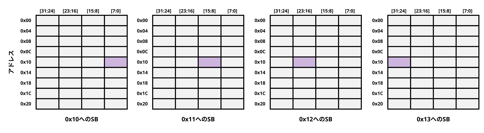
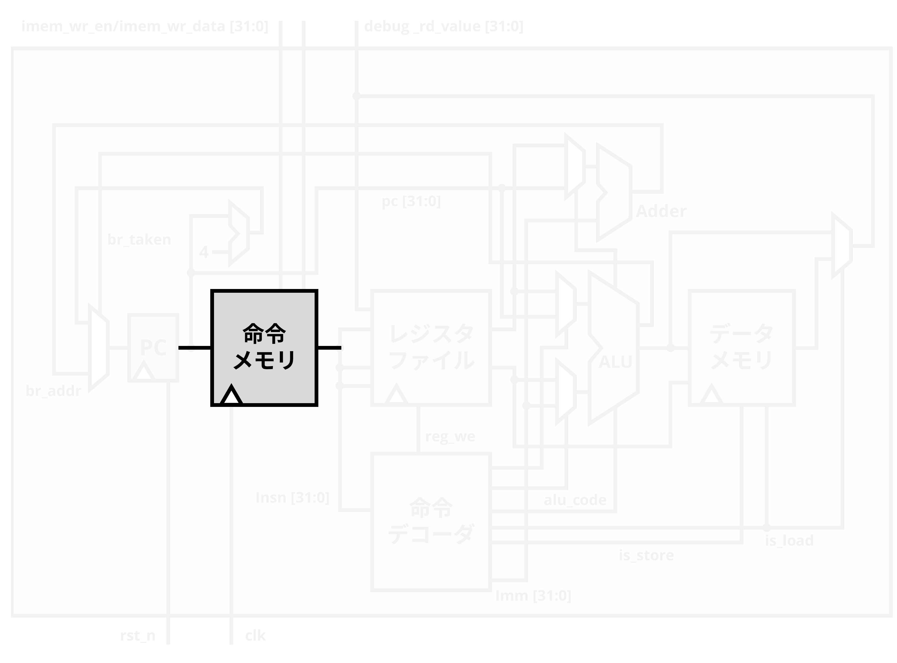

#  第4回 プロセッサのVLSI実装

!!! abstract "本日の講義内容"
    - 汎用プロセッサの設計 (3)
    - プロセッサの論理合成


## 汎用プロセッサの設計 (3)

### メモリの基本

<figure markdown="span">
  { width="800" }
  <figcaption>プロセッサの全体図 (再掲)。</figcaption>
</figure>

本日はまず、メモリの設計を実施します。前回は汎用プロセッサの各機能ブロックの設計を進めました。プロセッサの全体図において残るブロックは命令メモリとデータメモリです。これらを設計して接続し、ひとまず動作するプロセッサを完成させることにします。

<figure markdown="span">
  { width="500" }
  <figcaption>メモリ。</figcaption>
</figure>

まずメモリの基本的な部分についておさらいしておきましょう。メモリには1Byte (8bit) 毎にアドレスが振られているのでした。上図では4Byte (32bit) のデータを1行として表現しています。たとえば命令メモリでは4Byteの命令列をフェッチして、また次の4Byteの命令列をフェッチして、と続けていくので、上図のように4Byte単位のデータを4ずつ異なったアドレスで扱っていくのでした。

RISC-V ISAでは基本的にメモリアクセスは**リトルエンディアン**で実行されることになっています。したがって、たとえば4Byteのデータが格納される場合、下位のバイトが下位のアドレスに格納されます。具体的には、アドレス`0x00`に32bitの命令やデータが格納される場合、`0x00`に`[7:0]`、`0x01`に`[15:8]`、`0x02`に`[23:16]`、`0x03`に`[31:24]`が格納されます。LBやLH、LBUやLHUといった命令で1Byteや2Byteのデータを読み出す際、あるいはSBやSHといった命令で1Byteや2Byteのデータを格納する際には、こうした順序を考慮する必要があります。以降で具体的に見ていきましょう。

<figure markdown="span">
  { width="500" }
  <figcaption>LWやSWの場合。</figcaption>
</figure>

まず、命令フェッチやLW、SWで4Byteのデータを扱う場合には、簡単です。図の1行に対応する部分にデータを読み出す、あるいはデータを書き込みます。これらの場合はメモリの左側に示した4ずつ異なるアドレスのいずれかが指定され、対応する4Byteのデータを操作することのみを考慮します。たとえば上の図では、アドレス`0x04`に対して4Byteのデータを読み書きすることを表現しています。

<figure markdown="span">
  { width="800" }
  <figcaption>LHやSHの場合。</figcaption>
</figure>

LH、LHU、SHで2Byteのデータを扱う場合には、いくつかのパターンが存在します。まず、`0x08`に対する命令を処理する場合、`0x08`と`0x09`に対応する2Byteの領域を読み書きします。また同様に、`0x09`に対する命令を処理する場合、`0x09`と`0x0A`に対応する2Byteの領域を、`0x0A`に対する命令を処理する場合、`0x0A`と`0x0B`に対応する2Byteの領域を読み書きします。

ただし、一番右に示すような、`0x0B`に対する命令については考慮しません。このように想定するバイトの境界をまたぐアクセスを非アラインのメモリアクセスと呼びます。なお、今回の実装においてはこのように仕様を定めますが、他のRISC-V ISAに基づく汎用プロセッサにおいては異なることもあります (コラム参照のこと)。

<figure markdown="span">
  { width="800" }
  <figcaption>LBやSBの場合。</figcaption>
</figure>

LB、LBU、SBで1Byteのデータを扱う場合にも4Byteのそれぞれについて読み書きする場合があります。

以降では、命令デコーダによって生成した制御信号`is_load`や`is_store`とアドレスの情報を利用して、それぞれを場合分けし、データメモリを構築していきます。

!!! Tip "非アラインのメモリアクセス"
    [公式サイトの仕様書](https://riscv.org/specifications/ratified/)にあるように、RISC-V ISAでは非アラインのロードストア命令自体は許容されており、実行時の挙動はハードウェアやシステムソフトウェアの実装依存となっています。本講義では詳細まで立ち入りませんが、ハードウェアですべてサポートする他に、例外処理を通してシステムソフトウェアと協調して処理する場合があります。また、実行するコードに非アラインの命令が入っているかどうかはソフトウェアの記述やコンパイラの仕様にも依存します。たとえば、gccやClang/LLVMにおいては、データ型のサイズに応じて自然にアラインされた命令列が生成されることが多いほか、gccの`-mstrict-align`など、明示的にアラインを指定するオプションも存在します。今回の実装では、コンパイラのオプション等によって非アラインのメモリアクセス命令は抑制されており、そのような命令はハードウェアで実行されることがないという前提をとっています。

### データメモリの設計

<figure markdown="span">
  { width="500" }
  <figcaption>データメモリ。</figcaption>
</figure>

データメモリは`addr`、`is_load`、`is_store`といった信号に応じて操作するデータのアドレスや操作の内容を定めるのでした。`wr_data`はデータメモリに書き込むデータ、`rd_data`はデータメモリから読み出したデータになります。書き込みについてのみクロック同期でおこないます。

ここで、`is_load`、`is_store`について思い出してみると、

* `is_load == 3'b000` のとき: ロード無し
* `is_load == 3'b001` のとき: ロードバイト (8bit)、読み込んだデータは符号拡張
* `is_load == 3'b010` のとき: ロードハーフ (16bit)、読み込んだデータは符号拡張
* `is_load == 3'b011` のとき: ロードワード (32bit)
* `is_load == 3'b101` のとき: ロードバイト (8bit)、読み込んだデータはゼロ拡張
* `is_load == 3'b110` のとき: ロードハーフ (16bit)、読み込んだデータはゼロ拡張

* `is_store == 2'b00` のとき: ストア無し
* `is_store == 2'b01` のとき: ストアバイト (8bit)
* `is_store == 2'b10` のとき: ストアハーフ (16bit)
* `is_store == 2'b11` のとき: ストアワード (32bit)

となるように記述したのでした。これらの情報とアドレスの下位2bit`addr[1:0]`を活用することで、前述したような場合分けをおこなうことができます。

まずは、ストア処理部分を設計してみましょう。メモリ容量は32bitを256エントリ用意して、1KBとなるようにします。

!!! exercise "演習: データメモリのストア処理部分の設計"
    以下のコードを追記修正して、データメモリのストア処理部分を設計しましょう。
    ``` systemverilog linenums="1"
    module dmem (
        input logic clk,
        input logic [31:0] addr,
        input logic [31:0] wr_data,
        input logic [2:0] is_load,
        input logic [1:0] is_store,
        output logic [31:0] rd_data
    );

        logic [31:0] mem [0:255];
        logic [3:0] wr_en;
        logic [31:0] wr_data_aligned;

        // store
        always_comb begin
            unique case (is_store)
                2'b00: wr_en = 4'b0000;
                2'b01: begin
                    unique case (addr[1:0])
                        2'b00: wr_en = 4'b0001;
                        2'b01: wr_en = ;
                        2'b10: wr_en = ;
                        2'b11: wr_en = ;
                    endcase
                end
                2'b10: begin
                    unique case (addr[1:0])
                        2'b00: wr_en = ;
                        2'b01: wr_en = 4'b0110;
                        2'b10: wr_en = ;
                        default: wr_en = 4'b0000;
                    endcase
                end
                2'b11: wr_en = 4'b1111;
            endcase
        end

        always_comb begin
            unique case (addr[1:0])
                2'b00: wr_data_aligned = wr_data;                      
                2'b01: wr_data_aligned = {wr_data[23:0], 8'd0};
                2'b10: wr_data_aligned = {wr_data[15:0], 16'd0};
                2'b11: wr_data_aligned = {wr_data[ 7:0], 24'd0};
            endcase
        end

        always_ff @(posedge clk) begin
            if (wr_en[0]) mem[addr[31:2]][7:0] <= ;
            if (wr_en[1]) mem[addr[31:2]][15:8] <= ;
            if (wr_en[2]) mem[addr[31:2]][23:16] <= ;
            if (wr_en[3]) mem[addr[31:2]][31:24] <= ;
        end
    ```
    ??? Success "こたえ"
        ``` systemverilog linenums="1"
        module dmem (
            input logic clk,
            input logic [31:0] addr,
            input logic [31:0] wr_data,
            input logic [2:0] is_load,
            input logic [1:0] is_store,
            output logic [31:0] rd_data
        );

            logic [31:0] mem [0:255];
            logic [3:0] wr_en;
            logic [31:0] wr_data_aligned;

            // store
            always_comb begin
                unique case (is_store)
                    2'b00: wr_en = 4'b0000;
                    2'b01: begin
                        unique case (addr[1:0])
                            2'b00: wr_en = 4'b0001;
                            2'b01: wr_en = 4'b0010;
                            2'b10: wr_en = 4'b0100;
                            2'b11: wr_en = 4'b1000;
                        endcase
                    end
                    2'b10: begin
                        unique case (addr[1:0])
                            2'b00: wr_en = 4'b0011;
                            2'b01: wr_en = 4'b0110;
                            2'b10: wr_en = 4'b1100;
                            default: wr_en = 4'b0000;
                        endcase
                    end
                    2'b11: wr_en = 4'b1111;
                endcase
            end

            always_comb begin
                unique case (addr[1:0])
                    2'b00: wr_data_aligned = wr_data;                      
                    2'b01: wr_data_aligned = {wr_data[23:0], 8'd0};
                    2'b10: wr_data_aligned = {wr_data[15:0], 16'd0};
                    2'b11: wr_data_aligned = {wr_data[ 7:0], 24'd0};
                endcase
            end

            always_ff @(posedge clk) begin
                if (wr_en[0]) mem[addr[31:2]][7:0] <= wr_data_aligned[7:0];
                if (wr_en[1]) mem[addr[31:2]][15:8] <= wr_data_aligned[15:8];
                if (wr_en[2]) mem[addr[31:2]][23:16] <= wr_data_aligned[23:16];
                if (wr_en[3]) mem[addr[31:2]][31:24] <= wr_data_aligned[31:24];
            end
        ```

続いて、ロード処理部分についても設計してみましょう。

!!! exercise "演習: データメモリのロード処理部分の設計"
    以下のコードを追記修正して、データメモリのロード処理部分を設計しましょう。
    ``` systemverilog linenums="1"
    module dmem (
        input logic clk,
        input logic [31:0] addr,
        input logic [31:0] wr_data,
        input logic [2:0] is_load,
        input logic [1:0] is_store,
        output logic [31:0] rd_data
    );

        logic [31:0] mem [0:255];

        // store部分略

        // load
        always_comb begin
            unique case (is_load)
                3'b000: rd_data = 32'd0;
                3'b001: begin
                    unique case (addr[1:0])
                        2'b00: rd_data = ;
                        2'b01: rd_data = ;
                        2'b10: rd_data = ;
                        2'b11: rd_data = {{24{mem[addr[31:2]][31]}}, mem[addr[31:2]][31:24]};
                    endcase
                end
                3'b010: begin
                    unique case (addr[1:0])
                        2'b00: rd_data = ;
                        2'b01: rd_data = ;
                        2'b10: rd_data = ;
                        default: rd_data = 32'd0;
                    endcase
                end
                3'b011: rd_data = mem[addr[31:2]];
                3'b101: begin
                    unique case (addr[1:0])
                        2'b00: rd_data = ;
                        2'b01: rd_data = ;
                        2'b10: rd_data = ;
                        2'b11: rd_data = ;
                    endcase
                end
                3'b110: begin
                    unique case (addr[1:0])
                        2'b00: rd_data = ;
                        2'b01: rd_data = ;
                        2'b10: rd_data = {16'd0, mem[addr[31:2]][31:16]};
                        default: rd_data = 32'd0;
                    endcase
                end
                default: rd_data = 32'd0;
            endcase
        end

    endmodule
    ```
    ??? Success "こたえ"
        ``` systemverilog linenums="1"
        module dmem (
            input logic clk,
            input logic [31:0] addr,
            input logic [31:0] wr_data,
            input logic [2:0] is_load,
            input logic [1:0] is_store,
            output logic [31:0] rd_data
        );

            logic [31:0] mem [0:255];

            // store部分略

            // load
            always_comb begin
                unique case (is_load)
                    3'b000: rd_data = 32'd0;
                    3'b001: begin
                        unique case (addr[1:0])
                            2'b00: rd_data = {{24{mem[addr[31:2]][7]}}, mem[addr[31:2]][7:0]};
                            2'b01: rd_data = {{24{mem[addr[31:2]][15]}}, mem[addr[31:2]][15:8]};
                            2'b10: rd_data = {{24{mem[addr[31:2]][23]}}, mem[addr[31:2]][23:16]};
                            2'b11: rd_data = {{24{mem[addr[31:2]][31]}}, mem[addr[31:2]][31:24]};
                        endcase
                    end
                    3'b010: begin
                        unique case (addr[1:0])
                            2'b00: rd_data = {{16{mem[addr[31:2]][15]}}, mem[addr[31:2]][15:0]};
                            2'b01: rd_data = {{16{mem[addr[31:2]][23]}}, mem[addr[31:2]][23:8]};
                            2'b10: rd_data = {{16{mem[addr[31:2]][31]}}, mem[addr[31:2]][31:16]};
                            default: rd_data = 32'd0;
                        endcase
                    end
                    3'b011: rd_data = mem[addr[31:2]];
                    3'b101: begin
                        unique case (addr[1:0])
                            2'b00: rd_data = {24'd0, mem[addr[31:2]][7:0]};
                            2'b01: rd_data = {24'd0, mem[addr[31:2]][15:8]};
                            2'b10: rd_data = {24'd0, mem[addr[31:2]][23:16]};
                            2'b11: rd_data = {24'd0, mem[addr[31:2]][31:24]};
                        endcase
                    end
                    3'b110: begin
                        unique case (addr[1:0])
                            2'b00: rd_data = {16'd0, mem[addr[31:2]][15:0]};
                            2'b01: rd_data = {16'd0, mem[addr[31:2]][23:8]};
                            2'b10: rd_data = {16'd0, mem[addr[31:2]][31:16]};
                            default: rd_data = 32'd0;
                        endcase
                    end
                    default: rd_data = 32'd0;
                endcase
            end

        endmodule
        ```

最後にそれぞれを組み合わせれば、データメモリの完成です。

!!! exercise "演習: データメモリの設計"
    ストア処理部分とロード処理部分を合わせてデータメモリを設計しましょう。
    ??? Success "こたえ"
        ``` systemverilog linenums="1"
        module dmem (
            input logic clk,
            input logic [31:0] addr,
            input logic [31:0] wr_data,
            input logic [2:0] is_load,
            input logic [1:0] is_store,
            output logic [31:0] rd_data
        );

            logic [31:0] mem [0:255];
            logic [3:0] wr_en;
            logic [31:0] wr_data_aligned;

            // store
            always_comb begin
                unique case (is_store)
                    2'b00: wr_en = 4'b0000;
                    2'b01: begin
                        unique case (addr[1:0])
                            2'b00: wr_en = 4'b0001;
                            2'b01: wr_en = 4'b0010;
                            2'b10: wr_en = 4'b0100;
                            2'b11: wr_en = 4'b1000;
                        endcase
                    end
                    2'b10: begin
                        unique case (addr[1:0])
                            2'b00: wr_en = 4'b0011;
                            2'b01: wr_en = 4'b0110;
                            2'b10: wr_en = 4'b1100;
                            default: wr_en = 4'b0000;
                        endcase
                    end
                    2'b11: wr_en = 4'b1111;
                endcase
            end

            always_comb begin
                unique case (addr[1:0])
                    2'b00: wr_data_aligned = wr_data;                      
                    2'b01: wr_data_aligned = {wr_data[23:0], 8'd0};
                    2'b10: wr_data_aligned = {wr_data[15:0], 16'd0};
                    2'b11: wr_data_aligned = {wr_data[ 7:0], 24'd0};
                endcase
            end

            always_ff @(posedge clk) begin
                if (wr_en[0]) mem[addr[31:2]][7:0] <= wr_data_aligned[7:0];
                if (wr_en[1]) mem[addr[31:2]][15:8] <= wr_data_aligned[15:8];
                if (wr_en[2]) mem[addr[31:2]][23:16] <= wr_data_aligned[23:16];
                if (wr_en[3]) mem[addr[31:2]][31:24] <= wr_data_aligned[31:24];
            end

            // load
            always_comb begin
                unique case (is_load)
                    3'b000: rd_data = 32'd0;
                    3'b001: begin
                        unique case (addr[1:0])
                            2'b00: rd_data = {{24{mem[addr[31:2]][7]}}, mem[addr[31:2]][7:0]};
                            2'b01: rd_data = {{24{mem[addr[31:2]][15]}}, mem[addr[31:2]][15:8]};
                            2'b10: rd_data = {{24{mem[addr[31:2]][23]}}, mem[addr[31:2]][23:16]};
                            2'b11: rd_data = {{24{mem[addr[31:2]][31]}}, mem[addr[31:2]][31:24]};
                        endcase
                    end
                    3'b010: begin
                        unique case (addr[1:0])
                            2'b00: rd_data = {{16{mem[addr[31:2]][15]}}, mem[addr[31:2]][15:0]};
                            2'b01: rd_data = {{16{mem[addr[31:2]][23]}}, mem[addr[31:2]][23:8]};
                            2'b10: rd_data = {{16{mem[addr[31:2]][31]}}, mem[addr[31:2]][31:16]};
                            default: rd_data = 32'd0;
                        endcase
                    end
                    3'b011: rd_data = mem[addr[31:2]];
                    3'b101: begin
                        unique case (addr[1:0])
                            2'b00: rd_data = {24'd0, mem[addr[31:2]][7:0]};
                            2'b01: rd_data = {24'd0, mem[addr[31:2]][15:8]};
                            2'b10: rd_data = {24'd0, mem[addr[31:2]][23:16]};
                            2'b11: rd_data = {24'd0, mem[addr[31:2]][31:24]};
                        endcase
                    end
                    3'b110: begin
                        unique case (addr[1:0])
                            2'b00: rd_data = {16'd0, mem[addr[31:2]][15:0]};
                            2'b01: rd_data = {16'd0, mem[addr[31:2]][23:8]};
                            2'b10: rd_data = {16'd0, mem[addr[31:2]][31:16]};
                            default: rd_data = 32'd0;
                        endcase
                    end
                    default: rd_data = 32'd0;
                endcase
            end

        endmodule
        ```


### 命令メモリの設計

<figure markdown="span">
  { width="500" }
  <figcaption>命令メモリ。</figcaption>
</figure>

命令メモリはPCの指すアドレス`pc`に格納された32bitの命令列`insn`が読み出され、プログラムカウンタの指すアドレスに応じて32bitの機械語命令列を出力します。プロセッサの動作中、命令メモリでは基本的に読み出しのみがおこなわれるのですが、実行すべき命令列はあらかじめ格納されている必要があります。そのためここではデータ書き込み用の入力端子を用意しています。書き込みはデータメモリと同様クロック同期でおこないます。

``` systemverilog linenums="1" title="imem.sv"
module imem (
    input logic clk,
    input logic [31:0] addr,
    input logic [31:0] wr_data,
    input logic wr_en,
    output logic [31:0] rd_data
);

    logic [31:0] mem [0:255];

    // store
    always_ff @(posedge clk) begin
        if (wr_en) mem[addr[31:2]] <= wr_data;
    end

    // load
    assign rd_data = mem[addr[31:2]];

endmodule
```

これで汎用プロセッサ内の主要な要素回路は設計を完了しました。これからそれぞれを組み合わせてシングルサイクル動作のプロセッサを作っていきます。

### シングルサイクルプロセッサの設計

<figure markdown="span">
  { width="800" }
  <figcaption>プロセッサのトップ回路。</figcaption>
</figure>

ここまで作ってきた要素部品を組み合わせてシングルサイクルプロセッサを構成し、その動作を確認してみましょう。

まず、トップモジュールの入出力端子から見ていきましょう。ひとまず先ほど追加した命令メモリへの書き込み信号`imem_wr_data`と`imem_wr_en`を入力信号として用意します。また、レジスタファイルへの書き込みデータを`debug_rd_value`として外部にも出力します。全体に供給するクロック信号`clk`、プログラムカウンタをリセットするリセット信号`rst_n`についても入力信号になります。

そうした仕様をHDLで記述すると、トップモジュール`cpu_top.sv`の入出力部は以下のようになります。このトップモジュール以下に、設計してきたそれぞれの要素回路を呼び出していきます。

``` systemverilog linenums="1" title="cpu_top.sv"
module cpu_top (
    input logic clk,
    input logic rst_n,
    input logic [31:0] imem_wr_data,
    input logic imem_wr_en,
    output logic [31:0] debug_rd_value
);

endmodule
```

<figure markdown="span">
  { width="800" }
  <figcaption>プログラムカウンタの呼び出し。</figcaption>
</figure>

最初はプログラムカウンタを呼び出します。ここでは、分岐の有無を示す`br_taken`に応じて、`next_pc`が`br_addr`か`pc`に4を足したもののいずれかとして選択されるのでした。そうした選択のシンプルな組み合わせ回路定義と、program_counterのインスタンス呼び出しをおこないます。

!!! exercise "演習: プログラムカウンタの呼び出し"
    トップモジュールを追記修正して、プログラムカウンタを呼び出しましょう。
    ??? Success "こたえ"
        ``` systemverilog linenums="1"
        module cpu_top (
            input logic clk,
            input logic rst_n,
            input logic [31:0] imem_wr_data,
            input logic imem_wr_en,
            output logic [31:0] debug_rd_value
        );

            logic [31:0] next_pc;
            logic [31:0] pc;

            assign next_pc = br_taken ? br_addr : pc + 32'd4;

            program_counter pc_inst (
                .clk(clk),
                .rst_n(rst_n),
                .next_pc(next_pc),
                .pc(pc)
            );
        ```

<figure markdown="span">
  { width="800" }
  <figcaption>命令メモリの呼び出し。</figcaption>
</figure>

命令メモリを呼び出します。ここでは、シンプルに`pc`をアドレスとして受け、それに対応する機械語命令列`insn`を出力するのでした。また、命令メモリには`imem_wr_data`や`imem_wr_en`も入力されます。これらの信号接続を考慮しつつ呼び出します。

!!! exercise "演習: 命令メモリの呼び出し"
    トップモジュールを追記修正して、命令メモリを呼び出しましょう。
    ??? Success "こたえ"
        ``` systemverilog linenums="1"
        module cpu_top (
            input logic clk,
            input logic rst_n,
            input logic [31:0] imem_wr_data,
            input logic imem_wr_en,
            output logic [31:0] debug_rd_value
        );

            logic [31:0] next_pc;
            logic [31:0] pc;
            logic [31:0] insn;
            logic [31:0] imm;

            assign next_pc = br_taken ? br_addr : pc + 32'd4;

            program_counter pc_inst (
                .clk(clk),
                .rst_n(rst_n),
                .next_pc(next_pc),
                .pc(pc)
            );

            imem imem_inst (
                .clk(clk),
                .addr(pc),
                .wr_data(imem_wr_data),
                .wr_en(imem_wr_en),
                .rd_data(insn)
            );
        ```
<figure markdown="span">
  { width="800" }
  <figcaption>命令デコーダとレジスタファイルの呼び出し。</figcaption>
</figure>

命令デコーダとレジスタファイルを呼び出します。命令デコーダは機械語命令列`insn`を受けて各種制御信号を出力するのでした。また、レジスタファイルは`insn[19:15]`を`rs1`として、`insn[24:20]`を`rs2`として、`insn[11:7]`を`rd`として受け、命令デコーダからの`reg_we`や、後続する回路からの`rd_value`も入力として、`rs1_value`、`rs2_value`を出力します。未定義の信号の定義をおこないつつ呼び出します。

!!! exercise "演習: 命令デコーダとレジスタファイルの呼び出し"
    トップモジュールを追記修正して、命令デコーダとレジスタファイルを呼び出しましょう。
    ??? Success "こたえ"
        ``` systemverilog linenums="1"
        module cpu_top (
            input logic clk,
            input logic rst_n,
            input logic [31:0] imem_wr_data,
            input logic imem_wr_en,
            output logic [31:0] debug_rd_value
        );

            logic [31:0] next_pc;
            logic [31:0] pc;
            logic [31:0] insn;
            logic [31:0] imm;
            alu_code_t alu_code;
            logic alu_op1_sel;
            logic alu_op2_sel;
            logic reg_we;
            logic [2:0] is_load;
            logic [1:0] is_store;
            logic [31:0] rd_value;
            logic [31:0] rs1_value;
            logic [31:0] rs2_value;

            assign next_pc = br_taken ? br_addr : pc + 32'd4;

            program_counter pc_inst (
                .clk(clk),
                .rst_n(rst_n),
                .next_pc(next_pc),
                .pc(pc)
            );

            imem imem_inst (
                .clk(clk),
                .addr(pc),
                .wr_data(imem_wr_data),
                .wr_en(imem_wr_en),
                .rd_data(insn)
            );

            decoder decoder_inst (
                .insn(insn),
                .imm(imm),
                .alu_code(alu_code),
                .alu_op1_sel(alu_op1_sel),
                .alu_op2_sel(alu_op2_sel),
                .reg_we(reg_we),
                .is_load(is_load),
                .is_store(is_store)
            );

            regfile regfile_inst (
                .clk(clk),
                .reg_we(reg_we),
                .rs1(insn[19:15]),
                .rs2(insn[24:20]),
                .rd(insn[11:7]),
                .rd_value(rd_value),
                .rs1_value(rs1_value),
                .rs2_value(rs2_value)
            );
        ```

<figure markdown="span">
  { width="800" }
  <figcaption>ALUの呼び出し。</figcaption>
</figure>

ALUを呼び出し、分岐先アドレス計算の組み合わせ回路を記述します。ALUは`alu_op1_sel`と`alu_op2_sel`に応じて選択された信号と、命令デコーダからの`alu_code`を入力として、演算結果である`alu_result`や分岐の有無`br_taken`を出力するのでした。`alu_op1_sel`と`alu_op2_sel`によるシンプルな選択の組み合わせ回路を記述し、呼び出します。同時に、分岐先アドレス計算の組み合わせ回路についても記述します。分岐先アドレス`br_addr`は`alu_code`が`ALU_JALR`の場合のみ`rs1_value + imm`となり、その他の分岐命令の場合は`pc + imm`となります。未定義の信号の定義をおこないつつ呼び出します。`ALU_JALR`については`import cpu_pkg::*;`としてパラメータを利用すると良いでしょう。

!!! exercise "演習: ALUの呼び出し"
    トップモジュールを追記修正して、ALUを呼び出しましょう。
    ??? Success "こたえ"
        ``` systemverilog linenums="1"
        module cpu_top (
            input logic clk,
            input logic rst_n,
            input logic [31:0] imem_wr_data,
            input logic imem_wr_en,
            output logic [31:0] debug_rd_value
        );

            import cpu_pkg::*;

            logic [31:0] next_pc;
            logic [31:0] pc;
            logic [31:0] insn;
            logic [31:0] imm;
            alu_code_t alu_code;
            logic alu_op1_sel;
            logic alu_op2_sel;
            logic reg_we;
            logic [2:0] is_load;
            logic [1:0] is_store;
            logic [31:0] rd_value;
            logic [31:0] rs1_value;
            logic [31:0] rs2_value;
            logic [31:0] alu_op1;
            logic [31:0] alu_op2;
            logic [31:0] alu_result;
            logic br_taken;
            logic [31:0] br_addr;

            assign next_pc = br_taken ? br_addr : pc + 32'd4;

            program_counter pc_inst (
                .clk(clk),
                .rst_n(rst_n),
                .next_pc(next_pc),
                .pc(pc)
            );

            imem imem_inst (
                .clk(clk),
                .addr(pc),
                .wr_data(imem_wr_data),
                .wr_en(imem_wr_en),
                .rd_data(insn)
            );

            decoder decoder_inst (
                .insn(insn),
                .imm(imm),
                .alu_code(alu_code),
                .alu_op1_sel(alu_op1_sel),
                .alu_op2_sel(alu_op2_sel),
                .reg_we(reg_we),
                .is_load(is_load),
                .is_store(is_store)
            );

            regfile regfile_inst (
                .clk(clk),
                .reg_we(reg_we),
                .rs1(insn[19:15]),
                .rs2(insn[24:20]),
                .rd(insn[11:7]),
                .rd_value(rd_value),
                .rs1_value(rs1_value),
                .rs2_value(rs2_value)
            );

            assign alu_op1 = alu_op1_sel ? pc : rs1_value;
            assign alu_op2 = alu_op2_sel ? imm : rs2_value;
            
            alu alu_inst (
                .alu_code(alu_code),
                .op1(alu_op1),
                .op2(alu_op2),
                .alu_result(alu_result),
                .br_taken(br_taken)
            );

            assign br_addr = (alu_code == ALU_JALR) ? rs1_value + imm : pc + imm;
        ```

<figure markdown="span">
  { width="800" }
  <figcaption>データメモリの呼び出し。</figcaption>
</figure>

データメモリを呼び出し、デスティネーションレジスタへの書き込み内容を選択する組み合わせ回路を記述します。データメモリはALUによるアドレス計算結果`alu_result`をアドレスとして受け、`rs2_value`を書き込みデータとして受けます。また、`is_load`や`is_store`といった選択信号を入力としてそれらに応じて選択された書き込みや、`dmem_rd_data`の出力を実施します。その後、`is_load`に応じて`alu_result`か`dmem_rd_data`のどちらかを選択し、デスティネーションレジスタへと書き込みます。今回の実装では、これをデバッグ用の出力として外部にも出力します。

!!! exercise "演習: データメモリの呼び出し"
    トップモジュールを追記修正して、データメモリを呼び出しましょう。これで完成です。
    ??? Success "こたえ"
        ``` systemverilog linenums="1"
        module cpu_top (
            input logic clk,
            input logic rst_n,
            input logic [31:0] imem_wr_data,
            input logic imem_wr_en,
            output logic [31:0] debug_rd_value
        );

            import cpu_pkg::*;

            logic [31:0] next_pc;
            logic [31:0] pc;
            logic [31:0] insn;
            logic [31:0] imm;
            alu_code_t alu_code;
            logic alu_op1_sel;
            logic alu_op2_sel;
            logic reg_we;
            logic [2:0] is_load;
            logic [1:0] is_store;
            logic [31:0] rd_value;
            logic [31:0] rs1_value;
            logic [31:0] rs2_value;
            logic [31:0] alu_op1;
            logic [31:0] alu_op2;
            logic [31:0] alu_result;
            logic br_taken;
            logic [31:0] br_addr;
            logic [31:0] dmem_rd_data;

            assign next_pc = br_taken ? br_addr : pc + 32'd4;

            program_counter pc_inst (
                .clk(clk),
                .rst_n(rst_n),
                .next_pc(next_pc),
                .pc(pc)
            );

            imem imem_inst (
                .clk(clk),
                .addr(pc),
                .wr_data(imem_wr_data),
                .wr_en(imem_wr_en),
                .rd_data(insn)
            );

            decoder decoder_inst (
                .insn(insn),
                .imm(imm),
                .alu_code(alu_code),
                .alu_op1_sel(alu_op1_sel),
                .alu_op2_sel(alu_op2_sel),
                .reg_we(reg_we),
                .is_load(is_load),
                .is_store(is_store)
            );

            regfile regfile_inst (
                .clk(clk),
                .reg_we(reg_we),
                .rs1(insn[19:15]),
                .rs2(insn[24:20]),
                .rd(insn[11:7]),
                .rd_value(rd_value),
                .rs1_value(rs1_value),
                .rs2_value(rs2_value)
            );

            assign alu_op1 = alu_op1_sel ? pc : rs1_value;
            assign alu_op2 = alu_op2_sel ? imm : rs2_value;
            
            alu alu_inst (
                .alu_code(alu_code),
                .op1(alu_op1),
                .op2(alu_op2),
                .alu_result(alu_result),
                .br_taken(br_taken)
            );

            assign br_addr = (alu_code == ALU_JALR) ? rs1_value + imm : pc + imm;

            dmem dmem_inst (
                .clk(clk),
                .addr(alu_result),
                .wr_data(rs2_value),
                .is_load(is_load),
                .is_store(is_store),
                .rd_data(dmem_rd_data)
            );

            assign rd_value = (is_load != LOAD_DISABLE) ? dmem_rd_data : alu_result;
            
            // debug
            assign debug_rd_value = rd_value;

        endmodule
        ```

### シングルサイクルプロセッサの検証

設計したシングルサイクルプロセッサの動作をシミュレーションで検証してみましょう。

* `cpu_top.sv`
* `program_counter.sv`
* `imem.sv`
* `decoder.sv`
* `regfile.sv`
* `alu.sv`
* `dmem.sv`
* `cpu_pkg.sv`

をシミュレーション環境の同一の階層に集積しシミュレーションします。

今回はinitial文によって命令メモリの初期値を設定することで、RISC-V RV32Iの各種命令が実行可能なことを検証していきます。具体的には、`imem.sv`の内部で以下のような記述を実施します。

``` systemverilog linenums="1" title="imem.sv"
module imem (
    input logic clk,
    input logic [31:0] addr,
    input logic [31:0] wr_data,
    input logic wr_en,
    output logic [31:0] rd_data
);

    logic [31:0] mem [0:255];

    initial begin
        mem[0] = 32'h00000297;  // auipc t0,0
        mem[1] = 32'h00000317;  // auipc t1,0
        mem[2] = 32'h00000397;  // auipc t2,0
        mem[3] = 32'h10000413;  // addi s0,x0,256

        mem[4] = 32'h00128293;  // addi t0,t0,1
        mem[5] = 32'h00230313;  // addi t1,t1,2
        mem[6] = 32'h006283b3;  // add t2,t0,t1
        mem[7] = 32'h406283b3;  // sub t2,t0,t1

        mem[8] = 32'h00a28293;  // addi t0,t0,10
        mem[9] = 32'h00a30313;  // addi t1,t1,10
        mem[10] = 32'h0062f3b3;  // and t2,t0,t1
        mem[11] = 32'h0062e3b3;  // or t2,t0,t1
        mem[12] = 32'h0062c3b3;  // xor t2,t0,t1

        mem[13] = 32'h00229293;  // slli t0,t0,2
        mem[14] = 32'h00235313;  // srli t1,t1,2
        mem[15] = 32'h40235313;  // srai t1,t1,2

        mem[16] = 32'h00532e33;  // slt t3,t1,t0
        mem[17] = 32'h00533eb3;  // sltu t4,t1,t0

        for (int i = 18; i < 256; i++) begin
            mem[i] = 32'h00000013;
        end
    end

    // store
    always_ff @(posedge clk) begin
        if (wr_en) mem[addr[31:2]] <= wr_data;
    end

    // load
    assign rd_data = mem[addr[31:2]];

endmodule
```

簡単な命令列であれば、[RISC-Vアセンブラ](riscv_assembler.md)を利用して生成できます。汎用プロセッサはプログラマブルであるはずなので、今回のようにシミュレーションだけで利用可能な初期値代入ではなく、命令メモリに任意の命令を書き込んでいくための方法が本来必要となるはずです。そうした方法については次回以降にまた確認していくことにします。

また、テストベンチ`cpu_tb.sv`については以下のようなシンプルなものを用意してみます。ここでは命令メモリへの外部からの命令書き込みは常になしとして、クロックだけを変化させ動作を確認します。

``` systemverilog linenums="1" title="cpu_tb.sv"
`timescale 1ns/1ps

module cpu_tb;

  logic clk  = 1'b0;
  logic rst_n;

  localparam int CYCLE_NS = 20;
  always #(CYCLE_NS/2) clk = ~clk;

  logic [31:0] imem_wr_data = 32'd0;
  logic imem_wr_en = 1'b0;
  logic [31:0] debug_rd_value;
  
  cpu_top dut (
      .clk(clk),
      .rst_n(rst_n),
      .imem_wr_data(imem_wr_data),
      .imem_wr_en(imem_wr_en),
      .debug_rd_value(debug_rd_value)
  );

  initial begin
      rst_n = 1'b0;
      repeat (2) @(posedge clk);
      rst_n = 1'b1;

      #(10000);
      $finish;
  end

endmodule
```

それぞれのファイルが同階層に揃ったら、以下のコマンドで、XceliumにてGUIを利用したシミュレーションを実行できます。

```bash
$ xrun +gui -s +access+r cpu_tb.sv cpu_top.sv program_counter.sv imem.sv decoder.sv regfile.sv alu.sv dmem.sv cpu_pkg.sv
```

プログラムカウンタやレジスタファイルの値を見ると動作がわかりやすいと思います。

<figure markdown="span">
  { width="800" }
  <figcaption>シミュレーション波形の例。</figcaption>
</figure>

!!! exercise "演習: シングルサイクルプロセッサの検証"
    いくつかのRISC-V RV32I命令を実行して、プロセッサが動作していそうなことを確かめてみましょう。

!!! question "Open Question: 上の例ではレジスタファイルの値が真っ赤になっていますが、これは問題ないでしょうか? 一般にはどのように対処されているでしょうか?" 


## プロセッサの論理合成

```bash
$ cp /home/resources/syn_cpu.tcl ${自分の作業ディレクトリ}
```

として、論理合成用のスクリプトを自分の作業ディレクトリへとコピーし`WORK`というディレクトリを作成して先ほどのファイル一式を格納してみてください。

* `cpu_top.sv`
* `program_counter.sv`
* `imem.sv`
* `decoder.sv`
* `regfile.sv`
* `alu.sv`
* `dmem.sv`
* `cpu_pkg.sv`

それぞれのファイルが揃った状態で、作業ディレクトリで

```bash
$ dc_shell-xg-t -f syn_cpu.tcl
```

とすると、論理合成が実行されます。

```tcl title="syn_cpu.tclの抜粋"
# for Design
set rtl_dir "./WORK"
set rtl_src [list \
    "${rtl_dir}/cpu_pkg.sv"\
    "${rtl_dir}/dmem.sv"\
    "${rtl_dir}/alu.sv"\
    "${rtl_dir}/regfile.sv"\
    "${rtl_dir}/decoder.sv"\
    "${rtl_dir}/imem.sv"\
    "${rtl_dir}/program_counter.sv"\
    "${rtl_dir}/cpu_top.sv"\
]
set top_module "cpu_top"
set clk_period 1000.0
set clk_name "clk"

read_file -autoread -top ${top_module} -format sverilog ${rtl_src}
check_design
elaborate ${top_module}

create_clock -name ${clk_name} -period ${clk_period} ${clk_name}
set_input_delay 0 -clock ${clk_name} [remove_from_collection [all_inputs] {${clk_name}}]
set_output_delay 0 -clock ${clk_name} [all_outputs]
set_drive 0 ${clk_name}
set_driving_cell -lib_cell ${drv_cell_name} -pin ${drv_pin_name} [all_inputs]
set_load [expr 4 * [load_of [get_lib_pins ${lib_name}/${load_cell_name}/${load_pin_name}]]] [all_outputs]

set_max_area 0
set_max_fanout 48 [current_design]

compile_ultra

## print synthesis logs
check_design > ${top_module}_check.txt
report_timing -path full_clock -nets -transition_time -capacitance -attributes -sort_by slack > ${top_module}_timing.txt
report_area  > ${top_module}_area.txt
report_qor   > ${top_module}_qor.txt
report_port  > ${top_module}_port.txt
report_power > ${top_module}_power.txt

## create files for PnR
write -f verilog -hier -o ${top_module}.vnet

exit
```

実行してみると、ALUやレジスタファイル単体と比較して非常に時間がかかることがわかると思います (10分強で終了します)。これは主に巨大なメモリ回路が原因です。

結果のファイルから様々なことがわかります。

まず、`cpu_top_timing.txt`から、

* セットアップ時間`library setup time`が`7.89ps`であること
* クリティカルパス伝搬時間`data arrival time`が`816.66ps`であること

がわかります。したがって、想定最大動作周波数は`1/(816.66ps + 7.89ps) ≈ 1.21GHz`と求められます。

また、`cpu_top_area.txt`から、

* スタンダードセルの合計面積`Total cell area`が`36336.008485μm2`であること

がわかります。スタンダードセルを60%の密度で配置するとすると、最終的な面積は246μm角程度になると予想されます。

## :material-note-edit-outline: 自習課題

1から自分なりのディジタル回路をRTL設計して論理合成してみましょう。手順としては、

* ディジタル回路のRTL設計を`.sv`で記述する
* 講義中に利用した`.tcl`を参考に、自分が設計した回路に向けた`.tcl`を作成する
* Design Compilerで論理合成を実施し、結果を確認する

といったものになります。

**(提出等の必要はありません。)**

## :material-page-next: 次回予告

本日はここまでです。次回こそは配置配線を実施します。また、汎用プロセッサの高性能化を実施します。興味のある方は汎用プロセッサのマイクロアーキテクチャについて、たとえば、パイプライン化や分岐予測器について勉強してみてください。