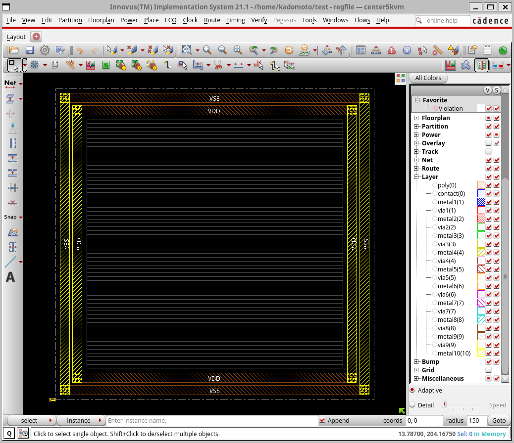
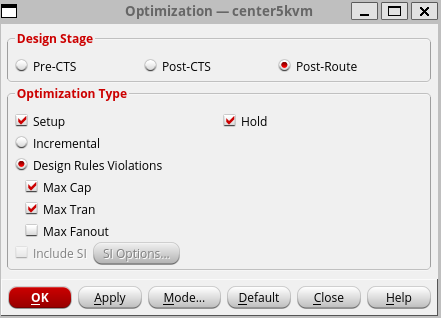
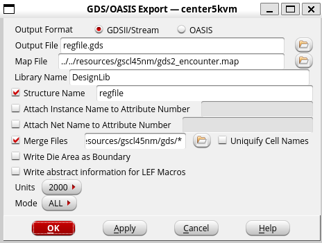

#  第5回 配置配線

!!! abstract "本日の講義内容"
    - Innovusを用いた配置配線
    
## Innovusを用いた配置配線

### 配置配線の基本

<figure markdown="span">
  { width="800" }
  <figcaption>簡易的に表現した配置配線フロー (再掲)。</figcaption>
</figure>

本日はまず配置配線に取り組んでいきます。配置配線では、ツールを利用して論理ゲートレベル設計をレイアウトへと変換するのでした。ツールとしては、**Cadence Innovus**を利用します。

配置配線にあたっても、論理合成と同様、論理ゲートの具体的なデータが格納されたスタンダードセルライブラリの情報や、タイミング等の制約が必要になります。より具体的には、

* **.lib**ファイル: 標準化された形式で、スタンダードセルライブラリ内の各セル (各論理ゲートやフリップフロップなど) の論理的な動作、遅延情報、消費電力、入出力特性 (遷移時間や容量) が記述されたテキストファイル。Libertyファイルと呼ぶ。
* **.lef**ファイル: スタンダードセルライブラリ内の各セルの物理配線情報がまとまったテキストファイル。
* **.gds**ファイル: スタンダードセルライブラリ内の各セルのレイアウトファイル。配置配線工程ではこれらと配線のレイアウトデータが組み合わさって最終的な一つのレイアウトファイルを生成する。
* **.sdc**ファイル: タイミングやクロック信号、容量といった制約がまとまったファイル。通常、論理合成ツールが出力するものを用いる。

といったものが必要になります。

!!! Tip ".dbファイルと.libファイル"
    SynopsysのDesign Compilerでは.dbファイルを利用しましたが、CadenceのInnovusでは.libファイルを利用します。これらは中身としては同様のLibertyファイルですが、前者は可読性の無いバイナリ形式で、後者は可読性のあるテキスト形式という違いがあります。製造プロセスによっては双方が揃っていないこともあるでしょう。.libのみが存在する場合、**Synopsys Library Compiler**というツールを用いて.libから.dbファイルを生成することができます。

### レジスタファイルの論理合成・配置配線

#### 環境設定

レジスタファイルの配置配線をおこないましょう。まず、Innovusを実行するための前準備として、`~/.cshrc`の末尾に、

```bash
# for cadence INNOVUS
set path = ( /home/kadomoto/innovus/bin \
             /home/kadomoto/innovus/tools.lnx86/bin \
             /home/kadomoto/innovus/tools.lnx86/dfII/bin \
             /home/kadomoto/innovus/share/oa/bin \
             $path )
```

といった記述を追記しておきます。その後、

```bash
$ source ~/.cshrc
```

とすることによってツールを実行可能にします。以降はターミナル起動時にこれを読み込むので何もしなくてもInnovusが利用可能なはずです。

#### レジスタファイルの論理合成

配置配線に先立って、まず、論理合成用のファイルを用意します。

```bash
$ cp -r /home/resources/WORK ${自分の作業ディレクトリ}
$ cp /home/resources/syn_regfile_45nm.tcl ${自分の作業ディレクトリ}
```

として、以前作成したレジスタファイルのRTL設計ファイル (`WORK/regfile.sv`, `WORK/cpu_pkg.sv`) と論理合成用スクリプト (`syn_alu_45nm.tcl`) を自分の作業ディレクトリへとコピーしましょう。論理合成スクリプトの冒頭は、今回論理合成・配置配線に利用する45nm CMOS製造プロセスのスタンダードセル固有の記述です。

なお、レジスタファイルのブロック図は以下のようなもので、中身としては32bitのレジスタが31個とゼロレジスタが1個存在するのでした。

<figure markdown="span">
  { width="500" }
  <figcaption>レジスタファイル (再掲)。</figcaption>
</figure>

ファイルが揃ったら、論理合成を実行します。

```bash
$ dc_shell-xg-t -f syn_regfile_45nm.tcl
```

生成された`regfile.vnet`を見ると、レジスタファイルを構成するために大量のDFFセルが呼び出されていることがわかります。また、

```bash
$ gedit regfile_area.txt
```

などとして面積を確認すると、`Total cell area`は`21117.561043`となり、スタンダードセルを70%の密度で配置するとすると、配置配線後の最終的な面積は174μm角程度になると予想されます。

#### レジスタファイルの配置配線 (Innovusの起動・基本設定)

続いて、配置配線を実行していきましょう。

```bash
$ innovus
```

とすると、Innovusが起動します。

<figure markdown="span">
  { width="800" }
  <figcaption>Innovusの起動画面。</figcaption>
</figure>

まず、Innovusに必要ファイルを読み込みます。`File`->`Import Design`から、設定画面を起動します。

<figure markdown="span">
  { width="600" }
  <figcaption>Innovusの初期設定画面。</figcaption>
</figure>

`Netlist`として、まずゲートレベル設計のVerilog HDLファイルを読み込みます。これは先ほど得られた論理合成後の`regfile.vnet`です。`Top Cell`についても`By User`として`regfile`と明示的に指定しておきます。

`Technology/Physical Libraries`としては、`LEF Files`から.lefファイルを読み込みます。これには`/home/resources/gscl45nm/gscl45nm.lef`を指定します。

`Power`で電源ネット名を指定します。ここではそれぞれ、`VDD`、`VSS`とします。

その後、`Create Analysis Configuration`から、タイミングライブラリや制約ファイルの指定をおこないます。様々な動作条件におけるタイミング制約を指定可能なことから、`Multi-Mode Multi-Corner (MMMC) Browser`という名称になっています。

<figure markdown="span">
  { width="600" }
  <figcaption>Innovusのタイミング制約設定画面。</figcaption>
</figure>

まず、タイミングや制約ファイルを指定しましょう。

<figure markdown="span">
  { width="800" }
  <figcaption>InnovusのMMMC Objects設定。</figcaption>
</figure>

`MMMC Objects`の中から`Library Sets`をダブルクリックして各セルのタイミングが記述された.libファイルを指定します。これには`/home/resources/gscl45nm/gscl45nm.lib`を指定します。`Name`に`default`という名前を入力して保存します。

また、`Delay Corners`をダブルクリックしてタイミング条件の指定をおこないます。`library Set`に先ほど設定した`default`ライブラリを指定して、これを元にタイミングを計算することにします。これについても、`Name`に`default`という名前を入力して保存します。

同様に、`Constraint Modes`をダブルクリックして制約を設定します。`SDC Constraint Files`として先ほど論理合成で生成した`regfile.sdc`を指定します。やはりこれも、`Name`に`default`という名前を入力して保存します。

その後、こうした指定内容をAnalysis Viewsに設定します。`Analysis Views`をダブルクリックして、`Constraint Mode`と`Delay Corner`を`default`とし、`Name`に`default`という名前を入力して保存します。その後、`Setup Analysis View`と`Hold Analysis View`に、この`default`を設定します。これにてMMMCの設定は完了です。

<figure markdown="span">
  { width="600" }
  <figcaption>InnovusのMMMC設定完了時の見た目。</figcaption>
</figure>

`Save&Close`より、`Default.view`と名前を付けて終了します。

<figure markdown="span">
  { width="600" }
  <figcaption>Innovusの初期設定完了時の見た目。</figcaption>
</figure>

ここで、`OK`として、初期設定を完了します。

#### レジスタファイルの配置配線 (フロアプラン)

続いて、フロアプランをおこないます。この工程では、最初に、スタンダードセルを配置する領域、マクロ（レイアウト済の大きめの部品）を配置する領域などを決めます。

初期設定を終えると、画面にスタンダードセル配置領域が既に仮決めされています。`k`でルーラーを使うことができるので、さきほどの見積と同程度の面積になっているか確認してみると良いでしょう (`Shift+k`で消せます)。

さて、画面上部の`Floorplan`->`Specify Floorplan`からスタンダードセル配置領域を詳細に指定できます。

<figure markdown="span">
  { width="600" }
  <figcaption>フロアプランの設定。</figcaption>
</figure>

ここではこのようにしてみましょう。`Ratio`を1 (正方形) に、`Core Utilization`を0.7として、配置密度を70%にします。また、`Core to IO Boundary`をそれぞれ20と指定して、I/Oとの距離を20μmとします。

<figure markdown="span">
  { width="800" }
  <figcaption>フロアプラン設定後の見た目。</figcaption>
</figure>

ここで、各I/Oピンの配置を指定します。Innovusを起動したターミナルに以下のようなコマンドを入力してみましょう。

``` bash
innovus x> editpin -pin clk -layer metal3 -spreadType CENTER -side bottom -use CLOCK 
innovus x> editpin -pin {rs2[0] rs2[1] rs2[2] rs2[3] rs2[4] rs1[0] rs1[1] rs1[2] rs1[3] rs1[4] rd[0] rd[1] rd[2] rd[3] rd[4]} -layer metal3 -spreadType CENTER -spacing 5 -side left
innovus x> editpin -pin {rs1_value[31] rs1_value[30] rs1_value[29] rs1_value[28] rs1_value[27] rs1_value[26] rs1_value[25] rs1_value[24] rs1_value[23] rs1_value[22] rs1_value[21] rs1_value[20] rs1_value[19] rs1_value[18] rs1_value[17] rs1_value[16] rs1_value[15] rs1_value[14] rs1_value[13] rs1_value[12] rs1_value[11] rs1_value[10] rs1_value[9] rs1_value[8] rs1_value[7] rs1_value[6] rs1_value[5] rs1_value[4] rs1_value[3] rs1_value[2] rs1_value[1] rs1_value[0] rs2_value[31] rs2_value[30] rs2_value[29] rs2_value[28] rs2_value[27] rs2_value[26] rs2_value[25] rs2_value[24] rs2_value[23] rs2_value[22] rs2_value[21] rs2_value[20] rs2_value[19] rs2_value[18] rs2_value[17] rs2_value[16] rs2_value[15] rs2_value[14] rs2_value[13] rs2_value[12] rs2_value[11] rs2_value[10] rs2_value[9] rs2_value[8] rs2_value[7] rs2_value[6] rs2_value[5] rs2_value[4] rs2_value[3] rs2_value[2] rs2_value[1] rs2_value[0]} -layer metal3 -spreadType CENTER -spacing 2 -side right
innovus x> editpin -pin {reg_we rd_value[31] rd_value[30] rd_value[29] rd_value[28] rd_value[27] rd_value[26] rd_value[25] rd_value[24] rd_value[23] rd_value[22] rd_value[21] rd_value[20] rd_value[19] rd_value[18] rd_value[17] rd_value[16] rd_value[15] rd_value[14] rd_value[13] rd_value[12] rd_value[11] rd_value[10] rd_value[9] rd_value[8] rd_value[7] rd_value[6] rd_value[5] rd_value[4] rd_value[3] rd_value[2] rd_value[1] rd_value[0]} -layer metal3 -spreadType CENTER -spacing 2 -side top
``` 

ここではまず最初のコマンドで`clk`を下部に配置しクロックとして指定、その後、`rd`、`rs1`、`rs2`を左側に等間隔で配置、`rs1_value`、`rs2_value`を右側に等間隔で配置しています。また、`reg_we`と`rd_value`を上部に等間隔で配置しています。こうしたピン配置は`Edit`->`Pin Editor`からより詳細に指定することもできます。

<figure markdown="span">
  { width="800" }
  <figcaption>I/Oピン設定後のレイアウト。</figcaption>
</figure>

続いて、電源リングを作成します。チップ外周やマクロの外周には、幅広の電源配線を形成することが多いです。低インピーダンスかつ均一な電源供給を目指してそうするものです。

`Power`->`Power Planning`->`Add Ring`より、次のように指定して、`VDD`と`VSS`のリング状配線を形成します。

<figure markdown="span">
  { width="600" }
  <figcaption>電源リングの設定。</figcaption>
</figure>

設定完了すると、電源リングが形成されます。

<figure markdown="span">
  { width="800" }
  <figcaption>電源リング配線後のレイアウト。</figcaption>
</figure>

その後、前準備として、以下のようなコマンドをターミナルに入力します。

``` bash
innovus x> globalNetConnect VDD -type pgpin -pin vdd
innovus x> globalNetConnect VSS -type pgpin -pin gnd
```

これによって、各スタンダードセルの電源がグローバルな電源と接続されます。

続いて`Route`->`Special Route`とすることで、電源リングからスタンダードセル配置予定の各列へ電源を配線できます。

<figure markdown="span">
  { width="600" }
  <figcaption>スタセル電源配線の設定。</figcaption>
</figure>

上のように指定して、`OK`とすると、交互にVDDとVSS電源レールが配線されます。

<figure markdown="span">
  { width="800" }
  <figcaption>電源レール配線後のレイアウト。</figcaption>
</figure>

ここまでの結果を保存してみましょう。`File`->`Save Design`から次のように指定してファイルを保存できます。これを`File`->`Restore Design`から呼び出すことで、保存した状態に復帰できます。なお、`.enc`という拡張子は、以前のツール名称 (Encounter) の名残です。

<figure markdown="span">
  { width="400" }
  <figcaption>ファイルの保存。</figcaption>
</figure>

#### レジスタファイルの配置配線 (配置)

次に、スタンダードセルを配置していきます。`Place`->`Place Standard Cell`として、起動したウィンドウで`OK`としてみましょう。

<figure markdown="span">
  { width="800" }
  <figcaption>スタセル配置後のレイアウト。</figcaption>
</figure>

右側のメニューから、`Cell`の`V (Visivility)`にチェックを付けると、スタンダードセル内部の配線も見ることができます。

<figure markdown="span">
  { width="800" }
  <figcaption>スタセル内部のレイアウト。</figcaption>
</figure>

#### レジスタファイルの配置配線 (CTS・配線)

さて、ここからいよいよ配線をしていきます。まず、クロックツリー合成 (CTS) 前向けの最適化を実行します。`ECO`->`Optimize Design`から、次のような設定で`OK`します。

<figure markdown="span">
  { width="400" }
  <figcaption>CTS前最適化。</figcaption>
</figure>

最適化によって少し配置が変化したのがわかると思います。

<figure markdown="span">
  { width="800" }
  <figcaption>CTS前最適化後のレイアウト。</figcaption>
</figure>

続いて、CTSを実施します。下のようなコマンドをターミナルに入力してみましょう。

``` bash
innovus x> set_ccopt_property buffer_cells {CLKBUF1 CLKBUF2 CLKBUF3}
innovus x> ccopt_design
```

最初のコマンドでクロックに用いるバッファセル名を指定し、その後のコマンドで合成を実行しています。

<figure markdown="span">
  { width="800" }
  <figcaption>CTS後のレイアウト。</figcaption>
</figure>

CTSによって、クロックの経路へバッファが挿入されます。また、うまくツリー状にクロックが分配されていることは、`Clock`->`CCOpt Clock Tree Debugger`から確認することができます。

<figure markdown="span">
  { width="800" }
  <figcaption>クロックツリーの様子。</figcaption>
</figure>

その後、CTS後向けの最適化を実行します。`ECO`->`Optimize Design`から、次のような設定で`OK`します。

<figure markdown="span">
  { width="400" }
  <figcaption>CTS後最適化。</figcaption>
</figure>

最適化によってまた配置が変化します。特にI/Oピンへ長く引き回されていた配線にセルが入って配線長が短縮されているのがわかると思います。

<figure markdown="span">
  { width="800" }
  <figcaption>CTS後のレイアウト。</figcaption>
</figure>

続いて、スタンダードセル間の詳細配線を実施します。`Route`->`NanoRoute`->`Route`より、以下のように指定して実行します。

<figure markdown="span">
  { width="600" }
  <figcaption>詳細配線の設定。</figcaption>
</figure>

詳細配線によって、スタンダードセル間がエラーの生じないよう接続されます。

<figure markdown="span">
  { width="800" }
  <figcaption>詳細配線後のレイアウト。</figcaption>
</figure>

詳細配線後にも最適化工程があります。まず、それに先立って、遅延計算や解析の設定をしておきます。

``` bash
innovus x> setDelayCalMode -engine aae -SIAware true
innovus x> setAnalysisMode -analysisType onChipVariation -cppr both
```

その後、`ECO`->`Optimize Design`から、次のような設定で`OK`します。

<figure markdown="span">
  { width="400" }
  <figcaption>詳細配線後最適化。</figcaption>
</figure>

その後、最後に空いている部分にフィラーセルと呼ばれるセルを挿入します。これは製造ルール上のエラーを防ぐもので、一般に挿入の必要があります。たとえば、NwellやPwellは多くの場合細かく分割されないようにする必要があり、スタセルが無くてもこれらが繋がるようにフィラーセルを挿入します。

`Place`->`Physical Cell`->`Add Filler`として、以下のように設定し、`OK`します。

<figure markdown="span">
  { width="400" }
  <figcaption>フィラー挿入設定。</figcaption>
</figure>

何も無かった部分に細いフィラーセルが挿入されているのがわかるかと思います。

<figure markdown="span">
  { width="800" }
  <figcaption>フィラーセルの入ったレイアウト。</figcaption>
</figure>

これにて、最終的なレイアウトが得られました。

<figure markdown="span">
  { width="800" }
  <figcaption>最終レイアウト。</figcaption>
</figure>

検証用のコマンドとして、以下のようなものがあります。実行して、ターミナルで結果を確認してみましょう。

* `Verify`->`Verify DRC`: レイアウトは製造ルールを満たしているか
* `Verify`->`Verify Connectivity`: 想定通りの接続になっているか

!!! question "Open Question: このレイアウトには実は問題点が残っており、製造できるかかなり怪しいです、どんなところが問題でしょうか?" 

#### レジスタファイルの配置配線 (レイアウト出力)

さて、無事完成したレイアウトを製造のために別の場所へ送付したり、あるいは他のレイアウトと組み合わせるためには、.gds形式で出力したいです。そこで、`File`->`Save`->`GDS/OASIS`から、出力の設定をします。

<figure markdown="span">
  { width="400" }
  <figcaption>出力設定。</figcaption>
</figure>

ここで、`Output File`には、出力ファイル名を、`Map File`には、.gdsのレイヤ番号とレイヤ名の対応が記述されたmapファイル (`/home/resources/gscl45nm/gds2_encounter.map`) を、`Merge Files`には、各スタンダードセルの.gdsファイル (`/home/resources/gscl45nm/gds/*`) をそれぞれ指定します。

出力されたファイルを別のアプリケーションから開いてみましょう。

```bash
$ /usr/bin/klayout ${出力した.gdsファイル名}
```

として、レイアウトを見ることができればokです。

<figure markdown="span">
  { width="800" }
  <figcaption>klayoutで見たレイアウト。</figcaption>
</figure>


#### スクリプト化とコマンドライン実行

配置配線しようと思ったときに、今回のような手順を毎回おこなうのはかなり面倒だと思います。効率的に実行していくために、こうした手順を自動化する手段が用意されています。

Innovusの操作履歴は、`innovus.cmd`というファイル名で保存されます。ここにおこなった操作がコマンドとして記録されているので、それをtclスクリプトなどにコピーして、そのスクリプトを実行するようにすればよいです。

実行したいコマンドを抜粋した.tclファイルを準備し、

``` bash
$ innovus -files ${.tclファイル名}
```

とすることで、論理合成のときと同じようなかたちで、コマンドラインから配置配線を実行することができます。

## :material-note-edit-outline: 自習課題

1から自分なりのディジタル回路をRTL設計して論理合成・配置配線してみましょう。手順としては、

* ディジタル回路のRTL設計を`.sv`で記述する
* 講義中に利用した`.tcl`を参考に、自分が設計した回路に向けた`.tcl`を作成する
* Design Compilerで論理合成を実施する
* Innovusで配置配線を実施する

といったものになります。

**(提出等の必要はありません。)**

## :material-page-next: 次回予告

本日はここまでです。次回はVLSI設計の流れを改めておさらいすると共に、プロセッサの高性能化、メモリや周辺回路、ソフトウェアといったトピックについて解説します。興味のある方はSRAMの構造やシステムソフトウェアについて復習してみてください。
